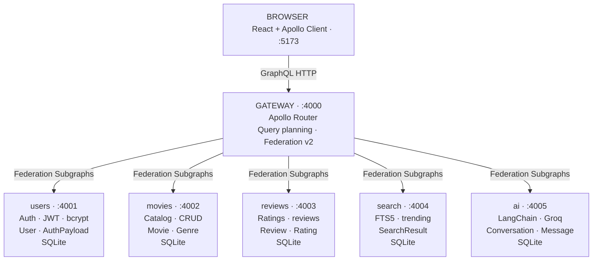
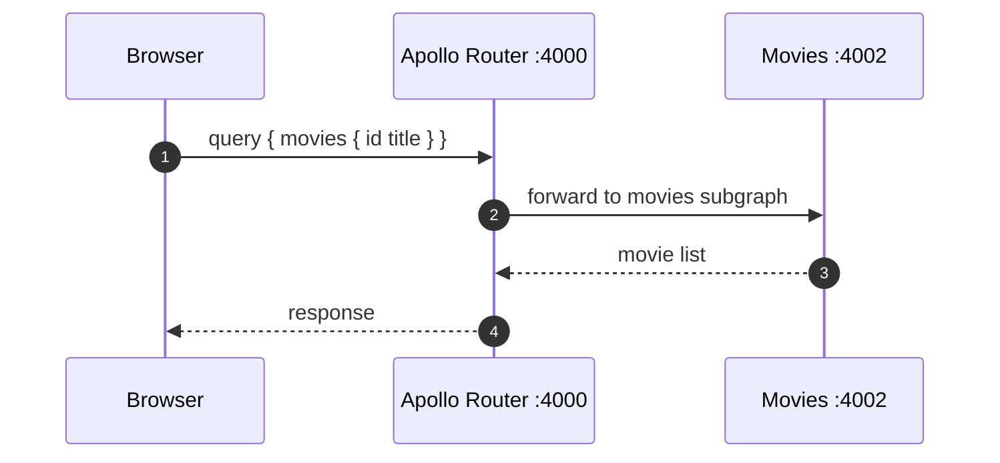
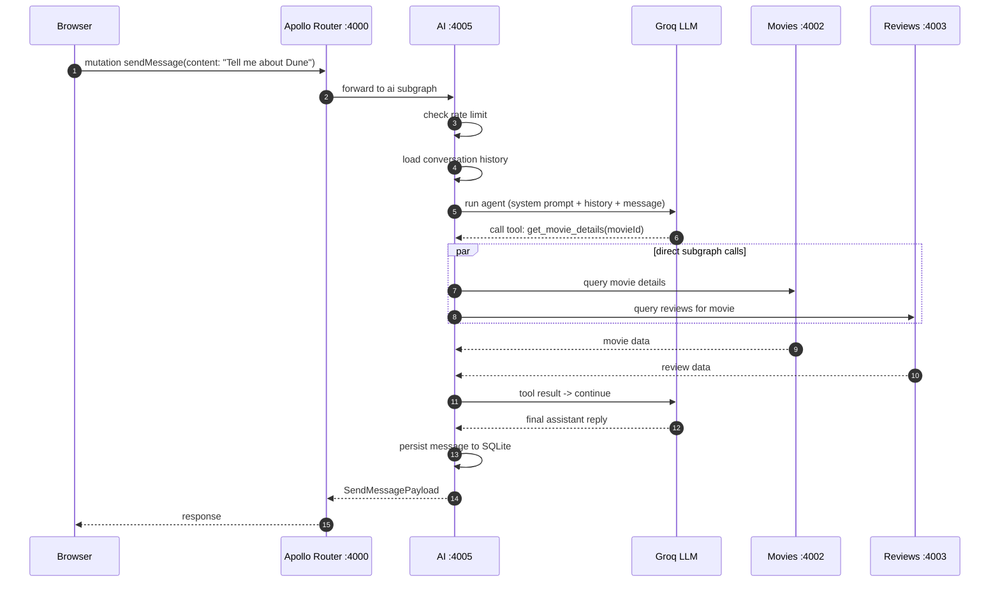

Most AI assistants live at `/api/chat` — outside your architecture, outside your graph, outside your auth model.

In this system, the AI is a first-class Apollo Federation subgraph, sitting alongside users, movies, reviews, and search. The frontend doesn't know there's an AI service. It calls `sendMessage` the same as any other mutation.

The platform is a movie catalog with five subgraphs behind an Apollo Router gateway:



The gateway composes all five into a single supergraph. From its point of view, the AI subgraph is just another service.

---

## Why Federation Instead of a Standalone Endpoint?

You could wire up a `/api/chat` REST endpoint and call it from the frontend. It works. But folding the AI into the federation gives you three things without writing extra code.

**Shared auth context.** The gateway forwards the JWT to every subgraph. The AI service gets `ctx.userId` and `ctx.token` from the gateway context automatically, and passes those tokens straight through when the agent calls other subgraphs on the user's behalf.

**Schema composability.** Conversations and messages become real types in the supergraph. Other services could reference `Conversation` by ID via federation's entity resolution if needed. The frontend queries chat history the same way it queries movies.

**One URL.** The frontend doesn't know there's an AI service. It calls `sendMessage` the same as any other mutation.

---

## Data Flow

A regular query (e.g. fetching the movie list) goes through the gateway and straight to one subgraph:



An AI message takes a different path. The gateway hands off to the AI subgraph, the agent decides which tools to call, and those tools talk directly to the target subgraphs — bypassing the gateway entirely (direct calls avoid an extra hop when the agent chains 3–5 tools per message):



---

## The Schema

```graphql
type Conversation @key(fields: "id") {
  id: ID!
  title: String!
  createdAt: String!
  updatedAt: String!
  messages: [Message!]!
}

type Message {
  id: ID!
  role: MessageRole!
  content: String!
  createdAt: String!
}

enum MessageRole {
  USER
  ASSISTANT
}

type SendMessagePayload {
  conversation: Conversation!
  message: Message!
}

input SendMessageInput {
  conversationId: ID
  content: String!
}

type Query {
  conversation(id: ID!): Conversation
  myConversations: [Conversation!]!
}

type Mutation {
  sendMessage(input: SendMessageInput!): SendMessagePayload!
}
```

`@key(fields: "id")` on `Conversation` makes it a federation entity. Other subgraphs can reference it by ID. The only other federation-specific line in the whole service is:

```typescript
export const schema = buildSubgraphSchema([{ typeDefs, resolvers }]);
```

That's it.

---

## Wiring It Into the Supergraph

Apollo Router uses a composed supergraph schema. You generate it with Rover CLI before building Docker images:

```yaml
federation_version: =2.3.0
subgraphs:
  ai:
    routing_url: http://ai:4005/graphql
    schema:
      file: ./services/ai/schema.graphql
```

```
rover supergraph compose --config supergraph.yaml
```

Rover reads the SDL files directly. No services need to be running at compose time.

---

## The Agent

The agent is a tool-calling LLM. Rather than answering directly, it decides when to call GraphQL-backed tools to read or write data. It uses LangChain with Groq, and it picks the model based on what the user is asking:

```typescript
function chooseModel(input: string): string {
  const lower = input.toLowerCase();
  const needsStrong =
    lower.includes('add') ||
    lower.includes('review') ||
    lower.includes('create') ||
    lower.includes('graphql');
  if (!needsStrong && input.length < 120) return 'llama-3.1-8b-instant';
  return 'llama-3.3-70b-versatile';
}
```

Short browsing queries use the faster 8B model. Anything involving writes, explicit GraphQL, or longer inputs gets routed to the 70B model. The tradeoff is cost vs. capability: the 8B is fast and cheap, but it's more likely to hallucinate arguments for mutations.

```typescript
const llm = new ChatGroq({
  model: chooseModel(userMessage),
  temperature: 0.3,
  maxTokens: 512,
  apiKey: process.env.GROQ_API_KEY,
});

const agent = createToolCallingAgent({ llm, tools, prompt });
const executor = new AgentExecutor({ agent, tools, maxIterations: 5 });
```

### Dynamic schema injection

On first use, the service introspects the gateway, builds the schema in memory, and formats all available Query and Mutation operations into a compact string. It strips federation internals like `_service` and `_entities` so the model only sees operations it can actually call. The result is cached indefinitely:

```typescript
let cachedSDL: string | null = null;

export async function fetchSchemaSDL(): Promise<string> {
  if (cachedSDL) return cachedSDL;
  // introspect, format, cache...
}

export function refreshSchemaSDL(): void {
  cachedSDL = null;
}
```

A TTL makes no sense here. The schema only changes on redeploy, and a redeploy restarts the service, which clears the in-process cache. `refreshSchemaSDL()` exists for manual use if you ever need it.

The formatted operations get appended to the system prompt. The base prompt itself is structured as a numbered priority list, not free text, so the model has an explicit decision order for picking tools:

```
Tool priority (use the first tool that fits):
1. list_movies — browsing the catalog, asking what movies exist
2. search_movies — finding a movie by title or keyword (never invent IDs)
3. get_movie_details — full info + reviews for a known movieId
4. add_movie — ONLY when user explicitly asks to add a movie
5. add_review — ONLY when user explicitly asks to submit a review
6. execute_graphql — last resort for operations not covered above
```

There's also an explicit rules section: always call a tool for live data, never answer from memory, never invent IDs, and if a tool returns an error, fix the arguments and retry once. The schema SDL then follows:

```typescript
function buildSystemPrompt(schemaSDL: string): string {
  if (!schemaSDL) return base;
  return `${base}\n\nAvailable GraphQL operations (for use with execute_graphql):\n${schemaSDL}`;
}
```

### Conversation history

Before each call, the resolver loads the last 20 messages from SQLite and passes them as chat history:

```typescript
const history = allMessages.slice(-MAX_HISTORY - 1, -1);
const reply = await runAgent(input.content, history, ctx.token);
```

---

## Tools That Talk to Other Subgraphs

Each tool makes a direct GraphQL request to its target service over Docker's internal network, not through the gateway. All of them share one helper:

```typescript
async function gqlFetch(
  url: string,
  query: string,
  variables: Record<string, unknown>,
  token?: string
): Promise<unknown> {
  const res = await fetch(`${url}/graphql`, {
    method: 'POST',
    headers: {
      'Content-Type': 'application/json',
      ...(token ? { Authorization: `Bearer ${token}` } : {}),
    },
    body: JSON.stringify({ query, variables }),
  });
  const json = await res.json();
  if (json.errors?.length) throw new Error(json.errors[0].message);
  return json.data;
}
```

The user's token travels with every request. When the agent calls `add_movie`, the movies service receives a real authenticated request and enforces its own auth rules. The agent has no elevated permissions.

Six tools in total:

| Tool | Target | Auth required |
|------|--------|---------------|
| `list_movies` | movies (direct) | No |
| `search_movies` | search (direct) | No |
| `get_movie_details` | movies + reviews (direct) | No |
| `add_movie` | movies (direct) | Yes |
| `add_review` | reviews (direct) | Yes |
| `execute_graphql` | gateway | Optional |

The first five go direct to their subgraph. `execute_graphql` is the fallback for anything not covered by the specialized tools. It routes through the gateway and accepts any valid query:

```typescript
const executeGraphQL = new DynamicStructuredTool({
  name: 'execute_graphql',
  description:
    'Execute any GraphQL query against the API. Use this for operations not covered by the specialized tools above.',
  schema: z.object({
    query: z.string().describe('Valid GraphQL query or mutation string'),
    variables: z.record(z.unknown()).optional(),
  }),
  func: async ({ query, variables }) => {
    const data = await gqlFetch(GATEWAY_URL, query, variables ?? {}, token);
    return JSON.stringify(data, null, 2);
  },
});
```

Because the model already has the formatted schema injected into its system prompt (covered above in "Dynamic schema injection"), it can construct valid queries without guessing. The specialized tools handle the common cases; `execute_graphql` covers the rest.

`get_movie_details` is worth calling out specifically. It fans out to two services in parallel and returns a combined result:

```typescript
const [movieData, reviewData] = await Promise.all([
  gqlFetch(MOVIES_URL, movieQuery, { id: movieId }),
  gqlFetch(REVIEWS_URL, reviewsQuery, { movieId }),
]);
```

The model gets both the movie and its reviews in one tool call.

---

## Why Tools Call Subgraphs Directly

Routing through the gateway would work, but the agent may call 3 to 5 tools per message. Each extra hop adds latency, and that compounds. Direct calls also keep auth enforcement inside each service where it belongs.

The tradeoff is that once you bypass the gateway, you also give up some centralized behavior. Observability, query controls, and policy enforcement are no longer automatic at the gateway layer, so you need to handle those concerns deliberately in the services themselves.

---

## Rate Limiting

The `sendMessage` resolver checks the rate limit before it does anything else:

```typescript
const HOURLY_LIMIT = 20;
const msgCount = countUserMessagesInLastHour(ctx.userId);
if (msgCount >= HOURLY_LIMIT) throw new Error('Rate limit exceeded: 20 messages per hour');
```

LLM calls cost money. Rejecting over-limit requests before building tools, fetching the schema, or running the agent means you pay nothing for them. The count is a single SQLite query, no external service required.

---

## Conversation History in SQLite

Every service in this stack uses `bun:sqlite`, Bun's built-in SQLite driver. No extra packages, no separate database process.

```typescript
const dbPath = process.env.DB_PATH ?? 'ai.db';
const db = new Database(dbPath, { create: true });

db.run(`
  CREATE TABLE IF NOT EXISTS conversations (
    id TEXT PRIMARY KEY,
    user_id TEXT NOT NULL,
    title TEXT NOT NULL,
    created_at TEXT NOT NULL,
    updated_at TEXT NOT NULL
  );
  CREATE TABLE IF NOT EXISTS messages (
    id TEXT PRIMARY KEY,
    conversation_id TEXT NOT NULL REFERENCES conversations(id),
    role TEXT NOT NULL,
    content TEXT NOT NULL,
    created_at TEXT NOT NULL
  );
`);
```

For a single-instance Docker container storing only conversation history, SQLite is fine. It's fast, it's local, and it eliminates an entire category of operational overhead.

---

## What I'd Change

**Streaming.** `sendMessage` blocks until the agent finishes. GraphQL subscriptions or chunked HTTP responses would make the chat feel less like submitting a form.

**Tool error handling.** When a tool throws, LangChain catches it and the model sometimes tries to work around it in ways that produce confusing output. Returning structured error objects instead of throwing would give the model cleaner signal.

**Separate agent modes for reads vs. writes.** The same agent instance handles both browsing and mutations. A read-only mode with a tighter prompt would reduce the risk of the model calling `add_movie` when the user just wanted a recommendation.

---

## Deployment

The run order matters. Compose the supergraph schema first, then build and start the containers:

```
bash compose-supergraph.sh
docker compose build
docker compose up
```

The AI service needs `GROQ_API_KEY`, `MOVIES_SERVICE_URL`, `REVIEWS_SERVICE_URL`, `GATEWAY_URL`, and `JWT_SECRET`. Everything else picks it up from the gateway context.

---

Treating the AI as a subgraph instead of a sidecar costs almost nothing extra, and you get shared auth, typed schema, and a single API surface for free. If you're already running Federation, the AI belongs in the graph.

The full code is on GitHub: [mrSamDev/GraphQL-Federation](https://github.com/mrSamDev/GraphQL-Federation)

Live demo: [movie.mrsamdev.xyz](https://movie.mrsamdev.xyz/)
