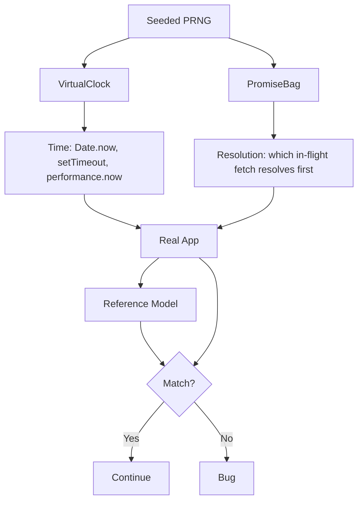

*Building a Deterministic Concurrency Harness in JavaScript*

In the first post, a random number generator found a cache bug by running thousands of sequential operations through a rendering engine. Same seed in, same trace out. It worked.

But it was sequential. No two requests were ever in flight at the same time. That's enough to catch a reset interleaving, but it leaves a whole category of bugs invisible — anything that only shows up when two config fetches race.

Going concurrent is where DST in JavaScript gets hard. Not because of parallelism — JavaScript is single-threaded. The problem is the event loop.

## Why the Event Loop Breaks Determinism

Two promises created in the same tick don't have to resolve in the order they were created. `queueMicrotask`, `setTimeout`, `await` — they all feed different queues, and the runtime picks which one drains next.

If the runtime decides which in-flight fetch resolves first, you've lost determinism. You can't replay a failure because the next run might pick a different order. A concurrent test without control over resolution order is just a flaky test you can't debug.

There was a second problem. `Date.now()`, `setTimeout`, `performance.now()`, and `crypto.randomUUID()` were all live. Three config loader code paths — circuit breaker cooldown, TTL (stale-while-revalidate), and config timeout — were untestable. `circuitBreakerCooldownMs` was hardcoded to 0. `configTtl` and `configTimeout` were never set. The clock was real. The tests couldn't touch it.

Two things had to become deterministic: time, and promise resolution order. Everything else was already driven by a seeded PRNG.

## The Architecture

The harness has two primitives that between them control every source of non-determinism:



The `VirtualClock` owns time. The `PromiseBag` owns promise resolution order. Both take the PRNG as input. Nothing else in the system gets to make a non-deterministic decision.

## VirtualClock

Hijacks `Date.now`, `setTimeout`/`clearTimeout`, `performance.now`, and `crypto.randomUUID` with a controllable virtual time. `clock.advance(ms)` fires scheduled timers in chronological order.

Without this, circuit breaker cooldown, stale-while-revalidate, and config timeout paths were unreachable — the real clock couldn't be moved. You'd set `circuitBreakerCooldownMs` to 5000, and the test would either wait five real seconds or skip the path entirely.

```ts
// VirtualClock: the PRNG controls time, so the circuit breaker's
// cooldown window and the TTL's stale-while-revalidate are deterministic.
clock.advance(circuitBreakerCooldownMs)  // breaker half-opens, exactly
```

The clock doesn't move on its own. `clock.advance(ms)` is the only way time passes. That means a test can fire a request, advance time past the cooldown, fire another, and know exactly which state the breaker is in. No real seconds elapse. No guessing.

## PromiseBag

Traps the config fetcher's resolution so the PRNG controls which in-flight operation resolves first.

`resolveOne(rng)` picks a random pending entry and resolves it. `resolveByIndex(idx, value)` gives deterministic control for race-condition tests where you want a specific order.

The bag is what makes concurrent batches work. When a batch fires five requests and three of them trigger config fetches, those three fetches land in the bag. The PRNG decides which resolves first, second, third. Not the event loop.

If you replay the seed, the bag resolves them in the same order every time. That's the whole point. Without it, you'd get a different interleaving on each run and never be able to reproduce the bug.

```ts
// Three config fetches trapped in the bag. The PRNG picks the order.
while (bag.size() > 0) {
  bag.resolveOne(rng)  // seed decides, not the event loop
}
```

## withClock and waitForBag

Two helpers that eliminated boilerplate and a fragile magic number.

`withClock(fn)` wraps `clock.install()` / `clock.restore()` in a try/finally, so cleanup happens even when assertions throw. Without it, every test had to remember to restore the clock in a finally block. One missed cleanup and the next test inherits a hijacked `Date.now`.

`waitForBag(bag, expected)` polls until the bag reaches the expected number of entries. It replaced `drainMicrotasks(10)` — a magic number that guessed how many ticks to wait for all in-flight promises to settle. It worked until a promise chain was deeper than 10 ticks, then it silently returned too early. `waitForBag` adapts to arbitrary depth.

## The Hybrid Fetcher

The config fetcher switches between two modes, and `buildRun()` controls which one is active:

- **Sync mode** — calls `makeFetcher(world)` immediately. Used for sequential ops where there's no concurrency to manage.
- **Batch mode** — traps the fetcher call in a `PromiseBag`. Used for concurrent batches where the PRNG needs to control resolution order.

One app instance handles both. `buildRun()` returns `bag`, `setBatchMode`, and `setSyncMode` alongside `app` and `world`, and accepts `circuitBreakerCooldownMs`, `configTtl`, `configTimeout`, and a logger.

```ts
interface BuildRunOptions {
  fetcher?: (world: World) => () => Promise<Response>
  circuitBreakerCooldownMs?: number
  configTtl?: number
  configTimeout?: number
  logger?: Logger
}
```

The mode switch is how `simulate()` handles mixed workloads — sequential ops run in sync mode, then a batch flips to batch mode, then the next sequential op flips back. The app doesn't know the difference. Only the harness does.

## Concurrent Batches

`genOpsWithBatches()` is the op generator that goes concurrent. Same sequential distribution as `genOps()`, but about 15% of ops are concurrent batches of 3-8 sub-ops (page, api, config).

Batches exclude `reset` and `failNext`. You can't reason about what "should" happen if a reset lands in the middle of a batch — the model would have to know which sub-op ran first, and that defeats the purpose of a batch. So batches are limited to ops where order doesn't matter for the invariant checks.

The `Op` type grew a `{ t: 'batch'; subOps: Op[] }` variant. `simulate()` fires all sub-ops concurrently through the full app, traps config fetcher calls in the `PromiseBag`, resolves via PRNG, and checks every response against the reference model with the same invariant checks as sequential ops.

```
SSR  /movie/123   TV
BATCH [page /, api /data, config]
SSR  /tv          TV
BATCH [page /search, api /search?q=hi, config]
RESET
SSR  /            browser
```

The sweep runs 50 seeds of mixed sequential and concurrent ops. Most sequences are boring. Some aren't.

## The Bug It Found

The concurrent harness found a bug on its first run. Seed 1013, first sweep. No sequential test could have caught it.

When a concurrent batch triggered a config fetch via the `PromiseBag`, the bag fetcher bypassed `makeFetcher(world)`, so `world.fetchCount` didn't increment. But `predictConfig(sim)` — the model's predictor — did increment `sim.fetchCount`. After the batch, the two counters diverged.

A later sequential op called `makeFetcher(world)`, which returned `{ version: world.fetchCount }` (stale), while the model predicted `{ version: sim.fetchCount }` (correct). The `/api/config` response mismatch was caught by the invariant check.

The fix was two lines — sync the world back to the model after `predictConfig` in the batch handler:

```ts
world.fetchCount = sim.fetchCount
world.loaded = sim.loaded
```

The world and the model were both internally consistent. They just disagreed with each other — and only when a batch fetch via the bag was followed by a sequential fetch via `makeFetcher(world)`. That interleaving doesn't exist in a sequential-only world. It doesn't exist if you control the PRNG but not the clock. It only exists when you go concurrent.

That's the validation. The harness found a bug that required every piece of the architecture to be in place: concurrent batches, PRNG-controlled resolution, and the reference model checking every response.

## Principles

A few things made this work. They're documented at the top of the test file, mostly so future me doesn't drift from them.

Every source of entropy comes from a fixed integer seed. Request order, paths, mode signals, error injection, resets — and now time and promise resolution order. If anything in the system makes a decision the seed didn't authorize, you've lost replayability.

`clock.advance(ms)` is the only way time moves. The `PromiseBag` is the only way an in-flight fetch resolves. Without those two, a concurrent test is just a flaky test you can't replay.

The reference model never imports the code under test. It's a separate, simpler reimplementation of the rules. If it imported the app, it'd be testing the app against itself, which proves nothing.

Batches exclude ops that would make the model order-dependent. `reset` and `failNext` change global state in ways the model can't predict without knowing the exact resolution order. Keeping them out of batches means the invariant checks stay valid regardless of which fetch resolves first.

`waitForBag` replaced a magic number. `withClock` replaced manual cleanup in every test. Both are small, but they're the kind of thing that rots a harness from the inside if you let it slide — a test that silently returns too early, or a clock that doesn't get restored and poisons the next test.

## What This Cost

16 tests became 24. The harness grew by a handful of utilities: `VirtualClock`, `PromiseBag`, `withClock`, `waitForBag`, a hybrid fetcher, a batch-aware op generator. Maybe 200 lines of harness code.

In return, three previously untestable code paths — circuit breaker, TTL, config timeout — became reachable. Concurrent batches became deterministic. And a bug that only exists when two fetches race showed up on the first run.

The event loop is the hardest part of DST in JavaScript. It's also the part nobody talks about, because most DST examples are in languages where the scheduler is already deterministic. In JavaScript, you have to build that yourself. It's not much code. But you have to build it.

---

This is the second part of a series on Deterministic Simulation Testing. The first part covers the sequential harness and the cache bug it found. If you're building something similar, I'm on <Link href="https://bsky.app/profile/sijosam.in">Bluesky</Link>.

import Link from '../../components/Link.astro';
import Callout from '../../components/Callout.astro';

<Callout variant="feedback" />