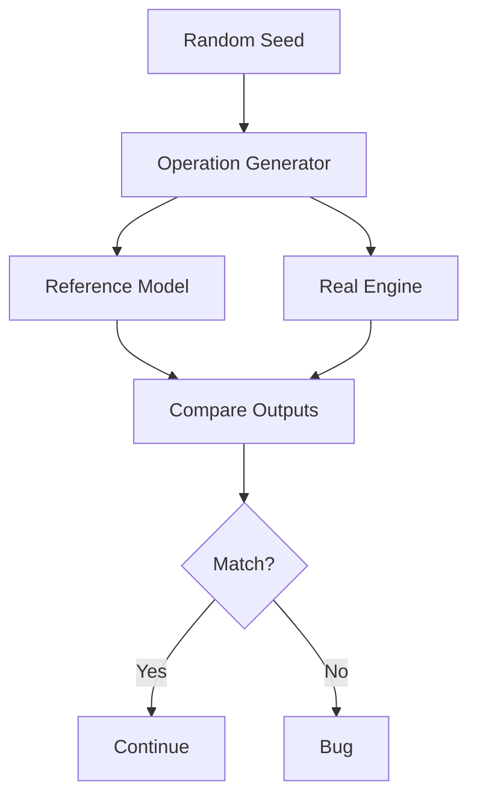
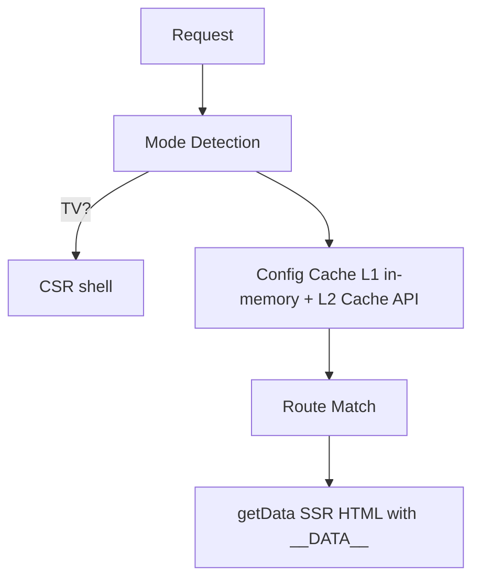

*How Deterministic Simulation Testing Found a Cache Bug My Unit Tests Missed*

A random number generator found a bug I didn't know I had. I wasn't fuzzing. It wasn't quite property testing either.

I'd been reading about [Deterministic Simulation Testing](https://turso.tech/blog/introducing-limbo-a-complete-rewrite-of-sqlite-in-rust), the approach [Turso](https://turso.tech) and [TigerBeetle](https://www.tigerbeetle.com/) use on their databases. I wanted to see if it made sense on something smaller, so I tried it on a frontend rendering engine.

## How I Stumbled Into This

I use Turso for most small projects. SQLite you can spin up in a few seconds is hard to argue with. A while back they announced they were rewriting SQLite from scratch, first as a fork, [libSQL](https://docs.turso.tech/libsql), then a full Rust rewrite.

The thing that caught my eye was their testing strategy. They kept mentioning DST, and I'd never heard of it. Could be I just wasn't paying attention.

I read more, and it started to click why you'd trust a rewrite of the most reliable database on earth to it.

The one-line version: model-based testing driven by deterministic randomness. You write a model of how your system should behave, then generate random sequences of operations and run them through the real thing. Every response gets compared to what the model predicted. A mismatch is a bug.

Because the randomness comes from a seed, the failure reproduces every time.

FoundationDB and TigerBeetle both rely on it. Turso partnered with [Antithesis](https://antithesis.com/) to run it at the OS level, injecting hardware faults into a deterministic hypervisor.

If you've used [QuickCheck](https://en.wikipedia.org/wiki/QuickCheck) or [fast-check](https://fast-check.dev/), the shape is familiar. The difference is scale. Property testing generates random inputs for a function. DST generates random sequences of operations for a whole system and checks each one against a reference model.

I'm not building a database. But I had a rendering engine with enough moving parts that I kept worrying about cases I hadn't tested.

So I scaled the idea down to fit in one test file. The shape of it:



## The Problem With Hand-Written Tests

Hand-written tests cover the paths you thought about. The ones you didn't think about are where production breaks. The weird interleavings. A config reset that lands between two requests. A fetch still in flight when the next one arrives.

You don't write tests for those because you don't know they exist. The shift with DST is that you stop guessing which cases matter.

You write down the rules of how the system behaves. Then a random number generator picks the cases, thousands of them, and you check that reality never breaks the rules.

## The Engine I Was Testing

The engine serves the same app two ways. Server-rendered HTML for browsers, a client-side shell for smart TVs. Every request goes through the same pipeline:



A few things can interact in a few too many ways:

- Mode detection from user-agent, query params, cookies, and client hints
- A two-layer config cache (in-memory + Cache API) with dedup and a circuit breaker
- Routes that throw, routes that recover, routes with no data at all
- Config resets that simulate an isolate restarting on the edge

Writing a test for every combination would take forever. I'd still miss the interesting ones. So I didn't.

## The Reference Model

Instead of asserting that a specific input gives a specific output, you write down the rules. Then you throw random stuff at the real thing and check that each response matches what the rules predict.

The rules live in a reference model. A plain object that mirrors the engine's config cache state machine:

```ts
// Mirrors the engine's config cache state machine so we can predict,
// for each op, exactly what the response should be, without trusting the app.
interface Sim {
  fetchCount: number    // how many times the fetcher should have been invoked
  loaded: boolean       // L1 populated?
  cachedVersion: number // version captured at last successful load
  failNext: boolean     // next fetch must throw (then consume)
  beforeRenderCalls: number
}
```

The model never imports the app. It just encodes what I believe should happen. If that belief is wrong, the test fails.

That's either a bug in the app or a bug in my understanding. Both are worth knowing about, though one is a lot more fun to find than the other.

## How a Run Works

Everything starts from a seed. Same seed, same sequence, every time.

```ts
// Seeded PRNG (mulberry32), no Math.random() anywhere
function mulberry32(seed: number): () => number {
  let a = seed >>> 0
  return function () {
    a |= 0; a = (a + 0x6D2B79F5) | 0
    let t = Math.imul(a ^ (a >>> 15), 1 | a)
    t = (t + Math.imul(t ^ (t >>> 7), 61 | t)) ^ t
    return ((t ^ (t >>> 14)) >>> 0) / 4294967296
  }
}
```

From the seed, a generator produces a random list of operations. Hit a page with TV user-agent signals. Call the data API. Fetch config. Simulate an isolate restart on the edge. Inject a failure into the next fetch. Each one is something that could happen in production.

Then I walk the list. For each op, two things happen in lockstep:

1. The **model** predicts what the response should be, and advances its own state.
2. The **real app** handles the request and produces an actual response.

Then I compare them. Status code, body, the `__DATA__` payload embedded in the HTML, the config version. Everything. A mismatch fails the test.

I'm not asserting that one endpoint returns 200. I'm asserting that across every combination of mode, route, and failure, the app behaves exactly like the model says it should. That's a stronger claim than any single test.

## The Bug It Found

I ran 32 seeds, 200 operations each. Around six thousand requests across the engine. It found something.

There's a comment in the test that captures what happened:

> A partial reset (clearing only `loaded`/`cachedVersion`) is what caused the model/engine divergence: the model predicted a refetch while the real engine served L1.

The model was right. It expected a refetch after reset. The engine served stale memory instead. The reset wasn't actually clearing the in-memory cache.

When an isolate restarted on the edge, the engine kept handing out config from the old one. A request would arrive, get a version number from an isolate that no longer existed, and carry on like nothing happened.

This is the kind of bug a hand-written test doesn't catch. It only shows up when a reset interleaves with config-touching requests in a particular order. Nobody writes a unit test for "what if the isolate restarts between the second and third request of a mixed batch." The simulation did, because it doesn't know or care what I think is interesting.

Because it's seeded, the failure reproduces exactly. Copy the seed, replay the op list, watch it break again. No flaky test, no "works on my machine."

## What Made It Work

I ended up with a few principles. They're documented at the top of the test file, mostly so future me doesn't drift from them.

If you're trusting a machine to find bugs, the machine has to behave predictably. Every source of entropy in my setup comes from a fixed integer seed. Request order, paths, mode signals, error injection, resets.

No `Math.random()`, no `Date.now()`. Same seed in, identical trace out. Without that, a failing test is just a story someone tells you.

The reference model never imports the code under test. It's a separate, simpler reimplementation of the rules. If it imported the app, it'd be testing the app against itself, which proves nothing.

Failures don't get swallowed. Every response gets checked against the model, every invariant gets an assertion. When something breaks, the test points at the seed and the op that triggered it. You copy the seed, replay the ops, and watch it fail. No digging through a stack trace wondering which combination of inputs caused it.

Randomized op sequences sweep the full mode, route, endpoint, and error space across many seeds. You don't pick the cases. The generator finds the corners you'd never look in.

When something does break, you get the seed and the op list. You can reduce it to a minimal repro. There's a helper at the bottom of the file for that:

```ts
// If a DST test fails, copy the failing seed and op count here to reproduce:
//
//   test('DST repro: seed 0xXXXX, N ops', async () => {
//     const ops = genOps(mulberry32(0xXXXX), N)
//     console.log(JSON.stringify(ops, null, 2))
//     await simulate(ops)
//   })
```

## What I Didn't Have to Write

I'm not arguing against unit tests. Targeted tests are still the right tool for "does this function parse this input." DST answers a different question: does the whole system hold up under sequences of events I didn't think to anticipate?

What I like is the tests I didn't have to write. I didn't write one for "reset, then two concurrent config requests, then an SSR page." I didn't write one for "fail the config, hit the data API, reset, hit config again." The simulation generated all of those. Thousands of them. Checked every response.

When it did fail, it failed on something real. A stale-cache bug that would've hit in production exactly once, at a time nobody was watching.

## Lessons

Every test you write by hand covers a path you already understood. The simulation finds the rest.

Comparing the real app against an independent model catches things a single assertion never would, because the model checks everything. You're checking behavior you didn't think to assert.

If your PRNG isn't seeded, a failing test is just a story someone tells you. You can't reproduce it, can't debug it, can't fix it with confidence. That's what makes determinism non-optional.

I spent an afternoon on the model and the harness. It's since run thousands of scenarios I'd never have typed out by hand. That felt like a good trade.

The reset bug wasn't in any ticket or any mental model I had of what might break. It was just sitting there. I needed a random sequence to stumble into it.

---

I wouldn't have tried this if Turso hadn't been so public about using it on their SQLite rewrite. It doesn't replace your other tests, and your model can be wrong too. But for a system with enough moving parts to surprise you, an afternoon of setup is worth it.

If you're doing something similar, I'm on [Bluesky](https://bsky.app/profile/sijosam.in). Curious what other people are trying beyond writing more tests and hoping.

import Callout from '../../components/Callout.astro';

<Callout variant="feedback" />

---

*Tags: [Testing](/tags/testing), [TypeScript](/tags/typescript), [Simulation](/tags/simulation), [Lessons Learned](/tags/lessons-learned)*