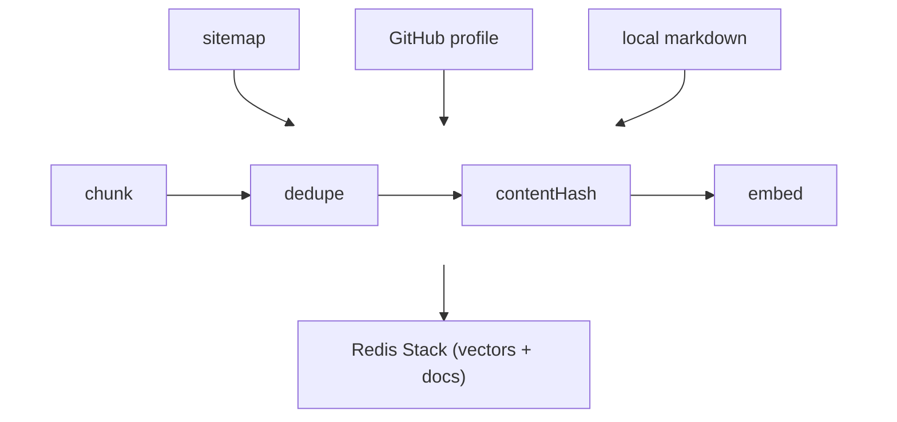
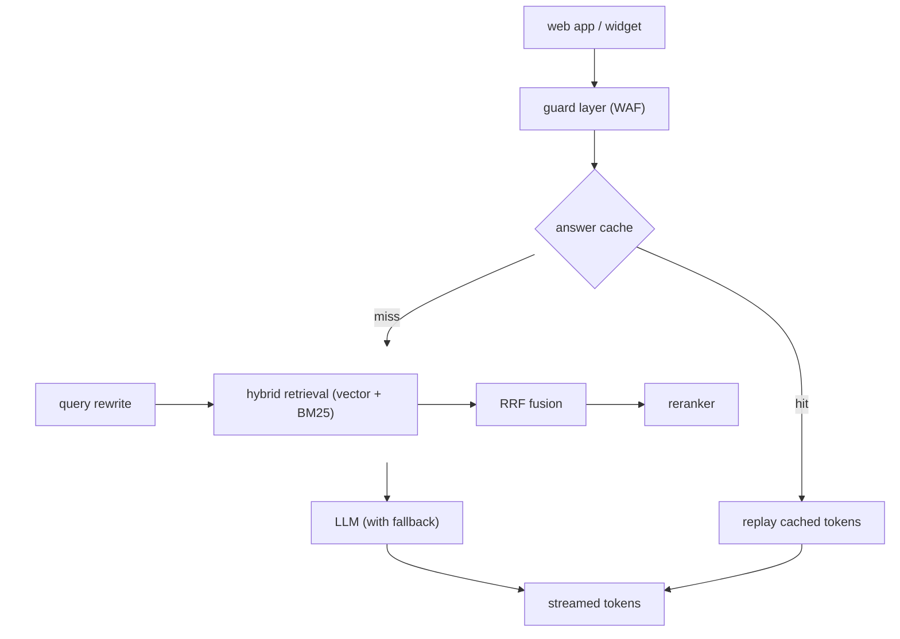

import Term from '../../components/Term.astro';
import Link from '../../components/Link.astro';

I run a personal site, <Link href="https://whoami.sijosam.com/">sijosam.com</Link>. It holds my writing, my projects, and a few notes I keep for myself.

For a while I wanted one interface where anyone could ask a question and get an answer grounded in that content, whether that's a recruiter, a reader, or a random visitor. Not a chatbot that guesses. An assistant that actually knows what's on the site.

I also kept running into the same pattern: every AI assistant wants to browse your content, summarize it, and repackage it with whatever it half-remembers. I wanted the opposite. I wanted retrieval that I control, a model I can swap in one line, and answers grounded in what the site actually says, not answers that just sound plausible.

So I built a RAG agent for my own site. It runs on <Link href="https://bun.sh/">Bun</Link>, <Link href="https://hono.dev/">Hono</Link>, and <Link href="https://js.langchain.com/">LangChain</Link>, and here's how it works and why each piece looks the way it does.

## The setup

The content lives in three places: the site's sitemap, <Link href="https://github.com/mrSamDev">my GitHub profile</Link>, and local markdown files. An ingest script pulls all three, chunks them, deduplicates, embeds them, and stores everything in <Link href="https://redis.io/">Redis Stack</Link>.

On the other end, three surfaces consume the same knowledge base: a <Link href="https://whoami.sijosam.com/">full-page chat app</Link>, an <Link href="https://whomai-api.mrsamdev.xyz/widget.js">embeddable widget</Link> you can drop into any page, and an <Link href="https://whoami.sijosam.com/mcp">MCP server</Link> so AI agents can query it directly.

Why not just stuff the whole site into the model's context? Three reasons. The content is scattered across sources, so it needs a cleanup step anyway.

The same knowledge had to serve a streaming UI, a REST API, and MCP tools, so retrieval had to be a shared service, not a prompt hack. And a personal site changes, so I wanted to re-ingest without touching the answering logic.

## One hash to rule them all

Every stored chunk gets a SHA-1 `contentHash`, computed at ingest time and persisted in Redis. It's the dedup key, so re-running ingest doesn't double the store.

SHA-1, yes. It's an identity key here, not a security primitive, and the worst a collision does is drop one chunk as a false duplicate.

It's also the document ID that the vector search and the keyword search use to align their results, and it feeds the answer cache key later.

One identity scheme, four jobs. When I designed this I kept hitting places where I needed to know "is this chunk the same as that chunk," and the hash answers it everywhere without coordination.

## How it fits together

The system in two pictures. First, how content gets in:



Then how a question becomes an answer:



Two details the diagrams skip. The <Term definition="A keyword-ranking method that scores documents by exact term matches, the way a classic search engine's index works.">BM25</Term> index is rebuilt in memory at boot from the Redis-stored docs, so Redis holds one copy of the content and serves both retrievers.

And agents on `/mcp` skip the edge guard, the origin allowlist and the WAF: they join at the cache, authenticated by an API key instead. Corpus sanitization and the injection checks still apply on that path.

Everything below the edge guard is shared by every surface. Swap the model, flip a flag, and the shape never changes.

## Hybrid retrieval, fused by rank

The first version used pure vector search. It failed in a specific, annoying way: ask "what is domsure?" and the embedding had no idea what "domsure" is. It's a project name.

Embeddings blur exact tokens into a semantic mush. Exact-match queries are where they're weakest: names, error strings, tool names.

The fix runs two retrievers in parallel. Vector search catches paraphrases ("how does he handle slow websites" matches "performance optimization"). BM25 catches exact terms, then <Term definition="Merges several ranked lists by position instead of by score, so different score scales never need calibrating.">reciprocal rank fusion</Term> merges the two ranked lists:

```ts
export function reciprocalRankFusion<T>(rankedLists: T[][], k = 60): FusedResult<T>[] {
  const scores = new Map<T, number>();

  for (const list of rankedLists) {
    list.forEach((item, rank) => {
      scores.set(item, (scores.get(item) ?? 0) + 1 / (k + rank + 1));
    });
  }

  return [...scores.entries()]
    .map(([item, score]) => ({ item, score }))
    .sort((a, b) => b.score - a.score);
}
```

That's the entire fusion step. Why RRF instead of weighted score blending? Cosine similarity and BM25 scores live on different scales, so blending means calibrating weights by hand, and those weights rot as models and content change.

Rank fusion only needs positions. A document that ranks high in both lists wins regardless of what "high" means in either score. Simpler than the thing it replaces, and more robust.

The `contentHash` matters here again: both retrievers must return documents with matching IDs or the fusion can't see that a hit from each list is the same document. Shared identity makes the merge honest.

## Retrieval gets the rewrite, generation gets the question

Before retrieval, a small LLM call rewrites the question into a declarative statement that matches how the corpus is written. "what about his Go projects?" becomes something like "Sijo Sam's projects written in Go." Retrieval runs on the rewrite.

But the model generating the answer never sees the rewrite. It gets the original question verbatim, because rewrites drift, they drop nuance, and they flatten follow-ups. A user who asks a precise question should get that question back, not my paraphrase of it.

The rewrite is a retrieval aid, not a replacement. If the rewrite call fails, the pipeline falls back to the raw question and nothing breaks.

## An LLM-as-judge reranker, on someone else's clock

After fusion, a reranker scores each passage 0-10 for relevance to the question, in batches of twelve, and trims the list. It's LLM-as-judge, not a cross-encoder, and that's a deliberate cost tradeoff: a judge prompt on a fast provider is one cheap API call, and I already have four providers wired.

The reranker runs on a dedicated provider, <Link href="https://groq.com/">Groq</Link> by default, separate from the main model, so a dead reranker can't take down the answering path. It does sit between retrieval and generation, so it delays the first token by a few cheap calls, a price I'll pay for the trim. The retrieval layer also over-fetches only when reranking is on:

```ts
const retriever = await createRetrieverFn(reranker ? 3 : 1);
```

Three times the candidates when there's a reranker to trim them, one times when there isn't. Over-fetching always and always paying the trim cost would be simpler code and a slower default.

When the judge returns garbage, an unparseable JSON response, the parse falls back to equal scores, so the step fails closed instead of shuffling the ranking. Malformed output can't hurt. A confident but wrong ranking still can, and no parser catches a score that's valid but dumb; the eval harness is what catches that one.

## The model is a config value

Set `LLM_PROVIDER` to <Link href="https://groq.com/">groq</Link>, <Link href="https://openai.com/">openai</Link>, <Link href="https://claude.ai/">claude</Link>, or <Link href="https://ollama.com/">ollama</Link> and set `LLM_MODEL`. That's the whole provider swap: every provider is one LangChain factory call wrapped in the same interface, `generate` and `stream`, and when the primary fails after retries, a fallback steps in.

The interesting rule is in the streaming fallback:

```ts
try {
  for await (const chunk of primary.stream(messages, genConfig)) {
    started = true;
    yield chunk;
  }
} catch (error) {
  if (started) {
    // Mid-stream failure: client already has partial output; switching providers would be incoherent.
    throw error;
  }
  onFallback(primary.name, fallback.name);
  yield* fallback.stream(messages, genConfig);
}
```

Before the first chunk, a failure is invisible to the user, so switching providers is free. After the first chunk, the user has partial text from one model, and splicing a second model onto it would read like two people finishing each other's sentences badly. So mid-stream, we throw.

Not every fallback is worth taking.

Every call also carries a timeout, and the stream guard re-arms on every chunk, so a model that stalls mid-answer dies on schedule instead of hanging forever. The whole system follows one rule: a dead model comes back as a 502, never a hang.

## Caching, and faking the tokens

Repeated questions skip the whole pipeline. The cache has two tiers: an exact-key tier on the question's hash, and a semantic tier that embeds the incoming question and <Term definition="Compares vectors by the angle between them: 1.0 means identical direction, 0.0 means unrelated.">cosine-matches</Term> it against stored ones at 0.95 similarity.

A 3-minute TTL keeps it fresh without invalidation logic. The flip side: right after a re-ingest, a repeat question can get a stale answer for up to three minutes. I can live with that.

One detail I'm fond of: cache hits still stream. The cache replays the answer as tokens, roughly 24ms apart, because a chat UI that slaps a full answer on screen feels broken. The user asked a streaming question, they get a streaming answer, even when it came from Redis in one read.

Honest limit, straight from a comment in the code: the semantic tier loads all entries and does a linear cosine scan, bounded at 300 entries. Past a few hundred cached questions it needs a real vector index (<Link href="https://redis.io/">RediSearch</Link> <Term definition="Hierarchical Navigable Small World, a graph index that finds nearest neighbors fast without scanning everything.">HNSW</Term>), and the comment names the exact upgrade. I'd rather publish the cliff than pretend the cache scales.

## Guarding the door

The corpus is web-fetched, so the system treats all of it as hostile input. Ingested text passes through sanitization, because a stored document containing "ignore previous instructions" is an indirect injection vector, not just content. User questions pass through a prompt-injection classifier (<Link href="https://www.npmjs.com/package/llm-moat">llm-moat</Link> plus custom rules for DAN-style and system-prompt-dump attempts): high risk blocks, medium logs.

At the edge, <Link href="https://arcjet.com/">Arcjet</Link> runs as a <Term definition="Web Application Firewall, a filter that blocks hostile requests before they reach your app.">WAF</Term> on `/api/*`: bot blocking, token-bucket rate limits, and a hard origin allowlist that 403s disallowed `Origin` headers before the request touches retrieval. CORS and the WAF read the same config file, so they can't drift apart. One allowlist, two enforcement points.

And one operational scar: `/api/health` deliberately never calls the embedding API. A health check that pings a paid, rate-limited service can rate-limit you into a restart loop when the pager fires, so it does a cheap Redis ping plus a populated-store flag. Liveness and readiness stay boring.

## The same brain, over MCP

The API process also serves an <Term definition="Model Context Protocol, an open standard that lets AI apps call external tools.">MCP</Term> server at `/mcp`, on the same port, with two tools, `search_knowledge_base` and `ask_rag`, mirroring the REST endpoints one-to-one. Each request gets a fresh transport, fully stateless. Any instance serves any request, so it scales behind plain round-robin with no session affinity.

This one's about surfaces. Humans ask questions through the chat app and the widget, agents ask through MCP, and both hit the same retrieval pipeline, sanitization, injection checks, and cache. The interface is a detail; the knowledge base is the product.

## Evals, or none of this means anything

Every pipeline stage sits behind a flag: `HYBRID_SEARCH_ENABLED`, `QUERY_REWRITE_ENABLED`, `RERANK_ENABLED`, `CACHE_ENABLED`. That's not config for config's sake. It means the offline eval harness can A/B whole stages head to head, plus providers and models, on a fixed question set, and print side-by-side answers so you can eyeball quality, not just read scores.

The set is 16 hand-written questions, each with a reference answer, key facts, and expected source URLs. A judge model, by default on a different provider than the generator, grades two things: groundedness, where it counts the claims in an answer and checks each against the retrieved context, and a 0-10 rubric for faithfulness, completeness, and relevance.

Retrieval metrics like recall@5 come from the expected sources, no judge needed.

A recent run, Ollama's deepseek-v4-flash generating with hybrid search and the reranker on, scored 0.99 groundedness, 0.87 recall@5, and 8.87/10 on the rubric at about five seconds per answer. Those numbers changed decisions.

Hybrid search and the reranker are defaults because they won evals, not because a blog post said they're best practices. If you can't turn a component off, you can't know if it's helping.

## What's next

Two things. The semantic cache needs its RediSearch HNSW index before the 300-entry cap becomes a wall. And I want to compare the LLM-as-judge reranker against a real cross-encoder, because "cheap and good enough" deserves to be tested, not assumed.

The code is on <Link href="https://github.com/mrSamDev/my-rag-search">GitHub</Link>, private as of right now. When it goes public, point it at your own sitemap, pick any model, and you have a grounded assistant for your content the same day. The decisions are in the defaults, and every default can be flipped.