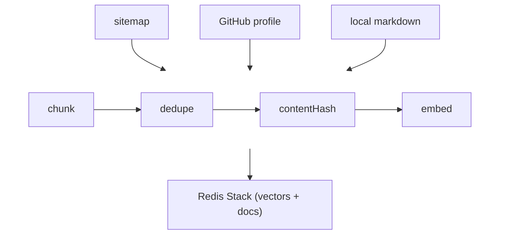
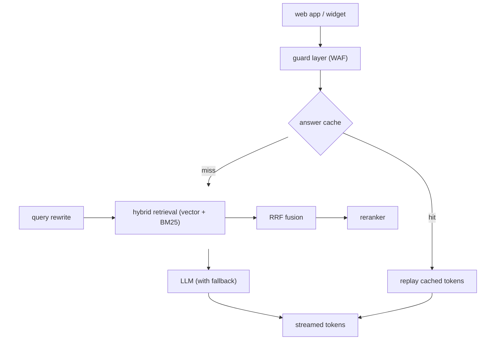

import Term from '../../components/Term.astro';
import Link from '../../components/Link.astro';

I run a personal site, <Link href="https://whoami.sijosam.com/">sijosam.com</Link>. It holds my writing, my projects, and a few notes I keep for myself.

For a while I wanted one interface where anyone could ask a question and get an answer grounded in that content. A recruiter, a reader, someone who found the site from a search result. Not a chatbot that guesses from memory. An assistant that has actually read the site.

The thing that pushed me to build it: every AI assistant I tried wanted to browse your content, summarize it, and hand it back repackaged with whatever it half-remembers from training. I wanted the opposite. Retrieval I control, a model I can swap in one line, and answers that come from what the site says instead of what sounds plausible.

So I built a RAG agent for my own site. RAG, retrieval-augmented generation, means you fetch the relevant text first and hand it to the model along with the question, instead of hoping the model already knows the answer. It runs on <Link href="https://bun.sh/">Bun</Link>, <Link href="https://hono.dev/">Hono</Link>, and <Link href="https://js.langchain.com/">LangChain</Link>. Here's how it works, and why each piece looks the way it does.

## The setup

The content lives in three places: the site's sitemap, <Link href="https://github.com/mrSamDev">my GitHub profile</Link>, and local markdown files. An ingest script pulls all three, chunks them, deduplicates, embeds them, and stores everything in <Link href="https://redis.io/">Redis Stack</Link>. Embedding means turning each chunk into a vector, a list of numbers that puts similar meanings close together, so a question about slow pages can find a chunk about performance.

Three surfaces consume the same knowledge base: a <Link href="https://whoami.sijosam.com/">full-page chat app</Link>, an <Link href="https://whomai-api.mrsamdev.xyz/widget.js">embeddable widget</Link> you can drop into any page, and an <Link href="https://whoami.sijosam.com/mcp">MCP server</Link> so AI agents can query it directly.

Why not paste the whole site into the model's context? For one, the content is scattered across sources and needs a cleanup step either way. The same knowledge also has to serve a streaming UI, a REST API, and MCP tools, so retrieval had to become a shared service rather than a prompt trick. And a personal site changes. I wanted to re-ingest without touching the answering logic.

## The content hash

Every chunk gets a SHA-1 `contentHash`, computed at ingest and persisted in Redis. It's the dedup key, so re-running ingest doesn't double the store.

SHA-1, yes. It's an identity key here, not a security primitive, and the worst a collision does is drop one chunk as a false duplicate.

The hash does three more jobs. It's the document ID vector search and keyword search use to align their results, and it becomes the cache key for answers later. I kept hitting places where I needed to know whether this chunk was the same as that chunk, and one identifier answered all of them without coordination.

## How it fits together

Two diagrams. First, how content gets in:


```mermaid h-350
flowchart TB
    sitemap["sitemap"] --> ingest
    github["GitHub profile"] --> ingest
    markdown["local markdown"] --> ingest
    subgraph ingest[" "]
        direction LR
        chunk["chunk"] --> dedupe["dedupe"]
        dedupe --> hash["contentHash"]
        hash --> embed["embed"]
    end
    ingest --> store["Redis Stack (vectors + docs)"]
    style ingest fill:none,stroke:none
```

Then how a question becomes an answer:


```mermaid h-450
flowchart TB
    surface["web app / widget"] --> guard["guard layer (WAF)"]
    guard --> cache{"answer cache"}
    cache -->|"hit"| replay["replay cached tokens"]
    cache -->|"miss"| pipeline
    subgraph pipeline[" "]
        direction LR
        rewrite["query rewrite"] --> hybrid["hybrid retrieval (vector + BM25)"]
        hybrid --> rrf["RRF fusion"]
        rrf --> reranker["reranker"]
    end
    pipeline --> llm["LLM (with fallback)"]
    llm --> tokens["streamed tokens"]
    replay --> tokens
    style pipeline fill:none,stroke:none
```

Two details the diagrams skip. The <Term definition="A keyword-ranking method that scores documents by exact term matches, the way a classic search engine's index works.">BM25</Term> index is rebuilt in memory at boot from the Redis-stored docs, so Redis keeps one copy of the content and feeds both retrievers.

And agents on `/mcp` skip the edge guard, the origin allowlist and the WAF: they join at the cache, authenticated by an API key instead. Corpus sanitization and the injection checks still run on that path.

Everything below the edge guard is shared by every surface. Swap the model, flip a flag, and nothing downstream notices.

## Hybrid retrieval, fused by rank

The first version used pure vector search, and it failed in a specific, annoying way. I asked it "what is domsure?" and got nothing useful back. Domsure is a project of mine, so the embedding had never seen the word, and there was no surrounding context for it to lean on. It's a name, not a description.

That's the weak spot for embeddings. They're good at meaning and bad at exact tokens: names, error strings, tool names. If the query is an identifier rather than a sentence, vector search is the wrong tool.

The fix runs two retrievers in parallel. Vector search catches paraphrases ("how does he handle slow websites" matches "performance optimization"). BM25 catches exact terms, and then <Term definition="Merges several ranked lists by position instead of by score, so different score scales never need calibrating.">reciprocal rank fusion</Term> merges the two ranked lists:

```ts
export function reciprocalRankFusion<T>(rankedLists: T[][], k = 60): FusedResult<T>[] {
  const scores = new Map<T, number>();

  for (const list of rankedLists) {
    list.forEach((item, rank) => {
      scores.set(item, (scores.get(item) ?? 0) + 1 / (k + rank + 1));
    });
  }

  return [...scores.entries()]
    .map(([item, score]) => ({ item, score }))
    .sort((a, b) => b.score - a.score);
}
```

That's the whole fusion step. I used RRF instead of weighted score blending because cosine similarity and BM25 scores live on different scales. Blending them means hand-calibrating weights, and those weights rot as the models and content change. Rank fusion only needs positions, so a document that ranks high in both lists wins regardless of what "high" means in either score.

The `contentHash` matters again here. Both retrievers have to return documents with matching IDs, or fusion can't tell that a hit from each list is the same document, and the merge stops making sense.

## Retrieval gets the rewrite, generation gets the question

Before retrieval, a small LLM call rewrites the question into a declarative statement that looks more like the corpus. "what about his Go projects?" becomes something like "Sijo Sam's projects written in Go." Retrieval runs on the rewrite.

The model generating the answer never sees it. It gets the original question verbatim, because rewrites drift, they drop nuance, and they flatten follow-ups. A user who asks a precise question should get that question back, not my paraphrase of it. If the rewrite call fails, the pipeline falls back to the raw question.

## The reranker

After fusion, a reranker scores each passage 0-10 for relevance, in batches of twelve, and trims the list. It's an LLM judge rather than a cross-encoder, a deliberate tradeoff on cost: a judge prompt on a fast provider is one cheap API call, and I already have four providers wired.

The reranker runs on a dedicated provider, <Link href="https://groq.com/">Groq</Link> by default, separate from the main model, so a dead reranker can't take down the answering path. It sits between retrieval and generation, so it delays the first token by a few cheap calls. I'll pay that for the trim. The retrieval layer over-fetches only when reranking is on:

```ts
const retriever = await createRetrieverFn(reranker ? 3 : 1);
```

Three candidates for every one I keep when there's a reranker to trim them, one when there isn't. Over-fetching always and paying the trim cost every time would be simpler code and a slower default.

When the judge returns garbage, an unparseable JSON response, the parse falls back to equal scores. The step fails closed instead of shuffling the ranking, so malformed output can't hurt anything. A confident but wrong ranking still can. No parser catches a score that's valid but dumb. That's what the eval harness is for.

## The model is a config value

Set `LLM_PROVIDER` to <Link href="https://groq.com/">groq</Link>, <Link href="https://openai.com/">openai</Link>, <Link href="https://claude.ai/">claude</Link>, or <Link href="https://ollama.com/">ollama</Link> and set `LLM_MODEL`. That's the whole provider swap: every provider is one LangChain factory call wrapped in the same interface, `generate` and `stream`, and when the primary fails after retries, a fallback steps in.

The streaming fallback is where the interesting rule lives:

```ts
try {
  for await (const chunk of primary.stream(messages, genConfig)) {
    started = true;
    yield chunk;
  }
} catch (error) {
  if (started) {
    // Mid-stream failure: client already has partial output; switching providers would be incoherent.
    throw error;
  }
  onFallback(primary.name, fallback.name);
  yield* fallback.stream(messages, genConfig);
}
```

Before the first chunk, a failure is invisible to the user, so switching providers costs nothing. After the first chunk, the user already has partial text from one model, and splicing a second model onto it reads like two people finishing each other's sentences badly. So mid-stream, we throw.

Every call also carries a timeout, and the stream guard re-arms on each chunk, so a model that stalls mid-answer dies on schedule instead of hanging forever. Across the whole system, a dead model comes back as a 502, never a hang.

## The answer cache

Repeated questions skip the pipeline. The cache has two tiers: an exact-key tier on the question's hash, and a semantic tier that embeds the incoming question and <Term definition="Compares vectors by the angle between them: 1.0 means identical direction, 0.0 means unrelated.">cosine-matches</Term> it against stored ones at 0.95 similarity.

A 3-minute TTL keeps the cache fresh without invalidation logic. The flip side is that right after a re-ingest, a repeat question can get a stale answer for up to three minutes. I can live with that.

Cache hits still stream. The cache replays the answer as tokens, roughly 24ms apart, because a chat UI that slaps a full answer on screen feels broken. The user asked a streaming question, so they get a streaming answer, even when it came out of Redis in one read.

The semantic tier has a limit I'd rather write down than pretend away. It loads all entries and does a linear cosine scan, bounded at 300 entries. Past a few hundred cached questions it needs a real vector index (<Link href="https://redis.io/">RediSearch</Link> <Term definition="Hierarchical Navigable Small World, a graph index that finds nearest neighbors fast without scanning everything.">HNSW</Term>), and the comment in the code names the exact upgrade.

## Guarding the door

The corpus is web-fetched, so the system treats all of it as hostile input. Ingested text passes through sanitization, because a stored document containing "ignore previous instructions" is an indirect injection vector, not just content. User questions pass through a prompt-injection classifier (<Link href="https://www.npmjs.com/package/llm-moat">llm-moat</Link> plus custom rules for DAN-style and system-prompt-dump attempts): high risk blocks, medium logs.

At the edge, <Link href="https://arcjet.com/">Arcjet</Link> runs as a <Term definition="Web Application Firewall, a filter that blocks hostile requests before they reach your app.">WAF</Term> on `/api/*`: bot blocking, token-bucket rate limits, and a hard origin allowlist that 403s disallowed `Origin` headers before the request touches retrieval. CORS and the WAF read the same config file, so they can't drift apart.

One operational scar: `/api/health` deliberately never calls the embedding API. A health check that pings a paid, rate-limited service can rate-limit you into a restart loop when the pager fires. It does a cheap Redis ping plus a populated-store flag instead.

## The MCP server

The API process also serves an <Term definition="Model Context Protocol, an open standard that lets AI apps call external tools.">MCP</Term> server on the same port, at `/mcp`, with two tools, `search_knowledge_base` and `ask_rag`, mirroring the REST endpoints one-to-one. Each request gets a fresh transport, and the server is fully stateless, so any instance can serve any request and it scales behind plain round-robin with no session affinity.

The point is the surfaces. Humans ask questions through the chat app and the widget, agents ask through MCP, and both hit the same retrieval pipeline, sanitization, injection checks, and cache, so there's one place to fix when something goes wrong.

## Evals

Every pipeline stage sits behind a flag: `HYBRID_SEARCH_ENABLED`, `QUERY_REWRITE_ENABLED`, `RERANK_ENABLED`, `CACHE_ENABLED`. That's not config for config's sake. It means the offline eval harness can A/B whole stages, and providers, and models, on a fixed question set, and print side-by-side answers so I can eyeball quality instead of only reading scores.

The set is 16 hand-written questions, each with a reference answer, key facts, and expected source URLs. A judge model, by default on a different provider than the generator, grades two things: groundedness, where it counts the claims in an answer and checks each against the retrieved context, and a 0-10 rubric for faithfulness, completeness, and relevance. Retrieval metrics like recall@5 come from the expected sources, no judge needed.

A recent run with Ollama's deepseek-v4-flash generating, hybrid search and the reranker on, scored 0.99 groundedness, 0.87 recall@5, and 8.87/10 on the rubric, at about five seconds per answer. Those numbers changed decisions. Hybrid search and the reranker are the defaults because they won evals, and if you can't turn a component off, you can't know whether it's helping.

## What's next

Two things. The semantic cache needs its RediSearch HNSW index before the 300-entry cap becomes a wall. And I want to compare the LLM judge against a real cross-encoder, because "cheap and good enough" deserves to be tested instead of assumed.

The code is on <Link href="https://github.com/mrSamDev/my-rag-search">GitHub</Link>, private for now. When it goes public, you can point it at your own sitemap, pick a model, and have a grounded assistant for your content the same day.
