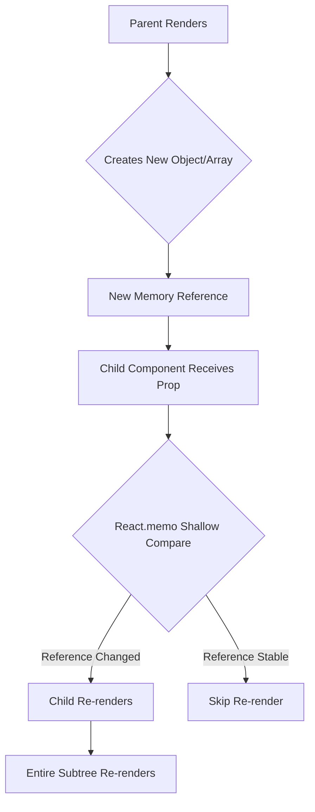
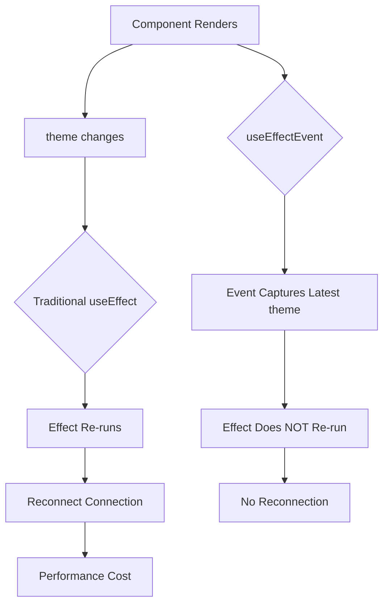
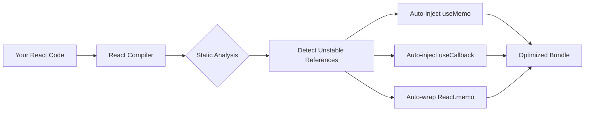

Fireship nailed it in his React Conf 2025 recap: "The greatest trick the devil ever pulled was making referential stability a prerequisite to writing React apps that don't blow up." That's not hyperbole. It's the truth about modern React development.

### The Core Problem

JavaScript compares primitives by value but objects by reference. When React checks if something changed, it asks: do these two variables point to the same spot in memory? If you create an object inline during render, it gets a new address every time. Same content, different reference.

React's optimization tools (React.memo, useEffect, useMemo) all depend on shallow comparison using Object.is(). When references flip unnecessarily, these optimizations fail. Your component tree re-renders in a cascade, burning CPU cycles for no reason.



### Real Damage

Cloudflare had a major outage because their dashboard kept hammering their own API with unnecessary calls. The culprit? Unstable references in useEffect dependencies. This wasn't a junior dev mistake on a side project. This was a production incident at a company that keeps half the internet running.

React's useEffect compares dependencies with shallow equality. Pass it an unstable object and the effect fires every single render. You get infinite loops, memory leaks, or API spam. Pick your poison.

### What Not to Do

Creating objects inline is deadly:

```jsx
// ❌ Creates new reference every render
function Dashboard() {
  const config = { url: 'api.com', timeout: 5000 };
  
  useEffect(() => {
    fetchData(config);
  }, [config]); // Effect runs on EVERY render
  
  return <div>Dashboard</div>;
}
```

Same goes for functions:

```jsx
// ❌ New function reference every render
function Parent() {
  return <MemoizedChild onClick={() => console.log('clicked')} />
}

// Child re-renders every time despite React.memo
const MemoizedChild = React.memo(({ onClick }) => {
  return <button onClick={onClick}>Click me</button>;
});
```

Inline arrays break memoization too:

```jsx
// ❌ New array reference every render
function UserList() {
  const userIds = [1, 2, 3]; // New reference each time
  
  return <UserDisplay ids={userIds} />;
}

const UserDisplay = React.memo(({ ids }) => {
  // Re-renders unnecessarily
  return ids.map(id => <User key={id} id={id} />);
});
```

### Manual Fixes

useMemo stabilizes objects and arrays:

```jsx
// ✅ Stable reference
function Dashboard() {
  const config = useMemo(() => ({
    url: 'api.com',
    timeout: 5000
  }), []); // Empty deps = stable across all renders
  
  useEffect(() => {
    fetchData(config);
  }, [config]); // Only runs once on mount
  
  return <div>Dashboard</div>;
}
```

useCallback does the same for functions:

```jsx
// ✅ Stable function reference
function Parent() {
  const handleClick = useCallback(() => {
    console.log('clicked');
  }, []); // Function identity preserved
  
  return <MemoizedChild onClick={handleClick} />
}

const MemoizedChild = React.memo(({ onClick }) => {
  // Only re-renders when actually needed
  return <button onClick={onClick}>Click me</button>;
});
```

The cleanest fix? Move object creation inside your effect:

```jsx
// ✅ No memoization needed
function Dashboard({ serverUrl, roomId }) {
  useEffect(() => {
    const options = { serverUrl, roomId }; // Created inside
    const connection = createConnection(options);
    connection.connect();
    
    return () => connection.disconnect();
  }, [serverUrl, roomId]); // Only primitives in deps
  
  return <div>Dashboard</div>;
}
```

For computed values, useMemo prevents expensive recalculations:

```jsx
// ✅ Only recalculates when data changes
function ExpensiveList({ data }) {
  const sortedData = useMemo(() => {
    return data.slice().sort((a, b) => a.value - b.value);
  }, [data]);
  
  return <List items={sortedData} />;
}
```

### The useEffectEvent Solution

React 19.2 introduced [useEffectEvent](https://react.dev/reference/react/useEffectEvent), which Fireship mentioned as a workaround for the useEffect complexity. This hook solves a specific problem: when you need to read the latest props or state inside an Effect without making those values reactive.

Here's the classic problem it solves:

```jsx
// ❌ The old dilemma
function ChatRoom({ roomId, theme }) {
  useEffect(() => {
    const connection = createConnection(serverUrl, roomId);
    connection.on('connected', () => {
      // We want the latest theme, but don't want to reconnect when it changes
      showNotification('Connected!', theme);
    });
    connection.connect();
    return () => connection.disconnect();
  }, [roomId, theme]); // Adding theme causes unnecessary reconnections
}
```

useEffectEvent gives you access to the latest values without triggering re-runs:

```jsx
// ✅ useEffectEvent to the rescue
import { useEffectEvent, useEffect } from 'react';

function ChatRoom({ roomId, theme }) {
  const onConnected = useEffectEvent(() => {
    // Always reads the latest theme, no stale closures
    showNotification('Connected!', theme);
  });

  useEffect(() => {
    const connection = createConnection(serverUrl, roomId);
    connection.on('connected', () => {
      onConnected(); // Call the Effect Event
    });
    connection.connect();
    return () => connection.disconnect();
  }, [roomId]); // Only reconnect when roomId changes
  
  return <div>Chat Room</div>;
}
```

This is particularly powerful for logging and analytics:

```jsx
// ✅ Log visits with cart count without re-running on cart changes
import { useEffect, useContext, useEffectEvent } from 'react';

function Page({ url }) {
  const { items } = useContext(ShoppingCartContext);
  const numberOfItems = items.length;

  const onNavigate = useEffectEvent((visitedUrl) => {
    // Always logs the current cart count, no stale data
    logVisit(visitedUrl, numberOfItems);
  });

  useEffect(() => {
    onNavigate(url);
  }, [url]); // Only log when URL changes, not when cart updates
  
  return <div>Page content</div>;
}
```



Important rules for useEffectEvent:

**Only call it inside Effects.** Don't pass Effect Events to other components or hooks. The eslint-plugin-react-hooks linter (version 6.1.1 or higher) enforces this.

**Not a dependency shortcut.** Don't use useEffectEvent just to avoid listing dependencies. That hides bugs. Use it only when you genuinely need the latest value without reactivity.

**For non-reactive logic only.** If the logic should respond to changes, keep it in the dependency array. useEffectEvent is for reading current values, not for controlling when effects run.

### The Compiler Changes Everything

[React Compiler 1.0](https://react.dev/learn/react-compiler) shipped in October 2025. Fireship's take: "It'll auto-optimize your app for you so you can stop pretending you care about how many times it re-renders." He's right.

The compiler runs at build time. It analyzes your component's control flow, spots unstable references, and inserts memoization automatically. You write clean code. It handles the performance work. This is fine-grained reactivity without the ceremony.



Here's what you write:

```jsx
// You write this
function TodoList({ todos, filter }) {
  const filtered = todos.filter(t => t.status === filter);
  const handleToggle = (id) => toggleTodo(id);
  
  return filtered.map(todo => 
    <TodoItem key={todo.id} todo={todo} onToggle={handleToggle} />
  );
}
```

The compiler transforms it to this:

```jsx
// Compiler outputs this
function TodoList({ todos, filter }) {
  const filtered = useMemo(() => 
    todos.filter(t => t.status === filter), 
    [todos, filter]
  );
  
  const handleToggle = useCallback((id) => 
    toggleTodo(id), 
    []
  );
  
  return filtered.map(todo => 
    <TodoItem key={todo.id} todo={todo} onToggle={handleToggle} />
  );
}

const TodoItem = React.memo(({ todo, onToggle }) => {
  // Component implementation
});
```

But there's a catch. The compiler needs functional purity. If your components have messy side effects or break the Rules of Hooks, the compiler bails out. Want the performance gains? Write cleaner code.

### How to Adopt It

New projects should enable the compiler immediately:

```bash
npm install babel-plugin-react-compiler
```

```javascript
// babel.config.js
module.exports = {
  plugins: [
    ['babel-plugin-react-compiler', {
      target: '18' // or '19'
    }]
  ]
};
```

Write normal React code and let it optimize. Done.

Existing codebases need patience. Keep your current useMemo, useCallback, and React.memo calls for now. The compiler works alongside them just fine:

```jsx
// This is fine during migration
function Component({ data }) {
  // Manual memoization you already have
  const processed = useMemo(() => expensiveOp(data), [data]);
  
  // Compiler will optimize the rest
  const display = format(processed);
  
  return <div>{display}</div>;
}
```

Focus on refactoring components to be functionally pure. That's where the real work lives.

### The Escape Hatch

Manual memoization isn't dead. It's now an escape hatch for when you need explicit control over useEffect dependencies:

```jsx
// ✅ Manual control for external sync
function ChatRoom({ roomId, serverUrl }) {
  // Explicitly stabilize the options object
  const options = useMemo(() => ({
    serverUrl,
    roomId
  }), [serverUrl, roomId]);
  
  useEffect(() => {
    const connection = createConnection(options);
    connection.connect();
    return () => connection.disconnect();
  }, [options]); // You control exactly when this runs
  
  return <div>Chat Room</div>;
}
```

Or combine it with useEffectEvent for maximum control:

```jsx
// ✅ The best of both worlds
function ChatRoom({ roomId, theme, onStatusChange }) {
  const onConnected = useEffectEvent(() => {
    showNotification('Connected!', theme);
    onStatusChange('connected');
  });

  const config = useMemo(() => ({
    serverUrl: 'https://api.example.com',
    roomId
  }), [roomId]);

  useEffect(() => {
    const connection = createConnection(config);
    connection.on('connected', onConnected);
    connection.connect();
    return () => connection.disconnect();
  }, [config]); // Precise control over when to reconnect
  
  return <div>Chat Room</div>;
}
```

If you're syncing with an external system and need to guarantee when side effects run, manual memoization gives you that control. The compiler can't read your mind about external timing requirements.

### The Bottom Line

Reference instability comes from JavaScript's memory model, not React's architecture. Shallow comparison is fast. Deep comparison is expensive. React chose speed.

The compiler shifts the burden from you to the build tool. useEffectEvent solves the non-reactive value problem elegantly. Together, they prove the React team learned something from 15 years of developer complaints.

Write clean, pure components. Enable the compiler. Use useEffectEvent when you need the latest values without reactivity. Stop micromanaging render cycles. That's how you win with modern React.

