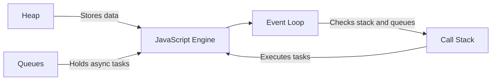
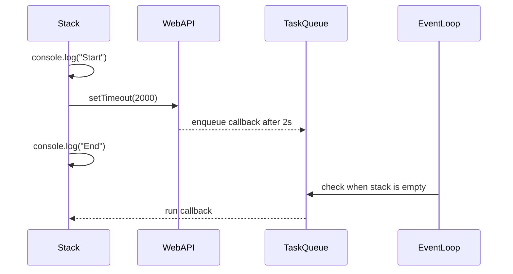
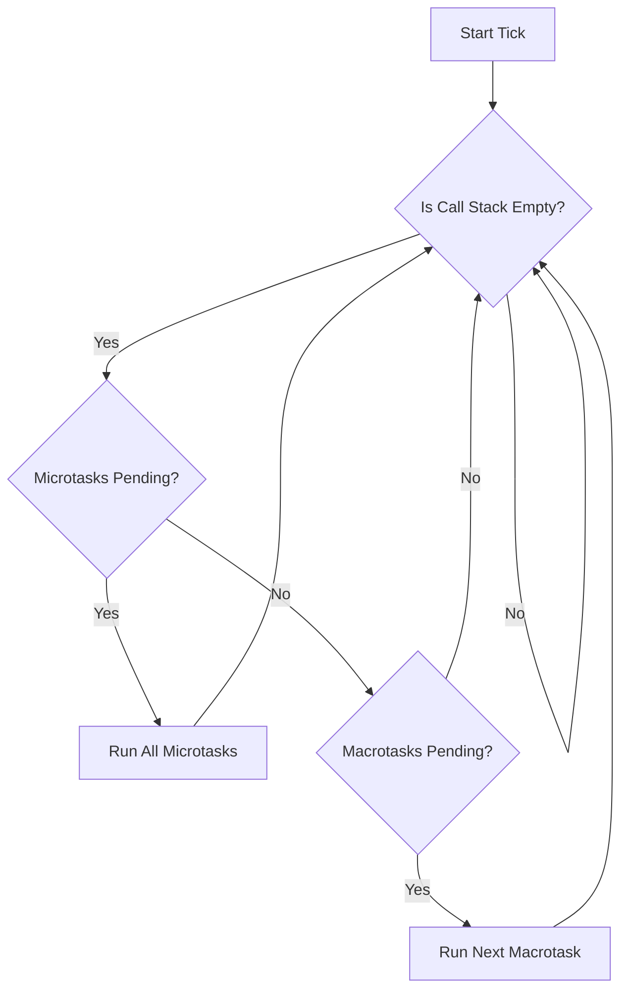
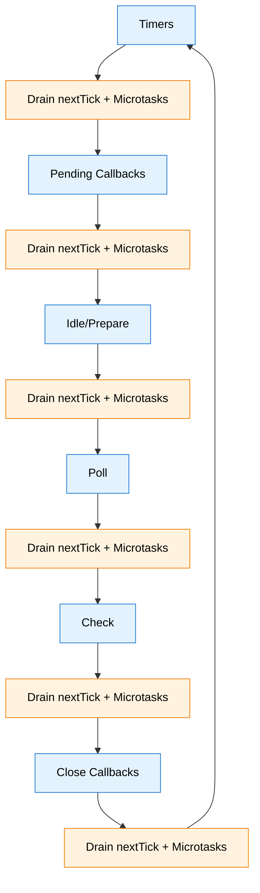

The engine runs synchronous code on the call stack, and stores data on the heap. Asynchronous work waits in queues until the stack is clear. The event loop checks the stack and queues, then schedules the next thing.



### Call stack execution

The call stack is LIFO, it pushes a frame for each call, then pops when the call completes. Only one frame runs at a time.

```js
function greet() {
  console.log('Hello');
}
console.log('Start');
greet();
console.log('End');
// Output:
// Start
// Hello
// End
```

### Asynchronous execution model

Browsers use Web APIs, Node uses its own APIs, both run timers and I/O off the main thread. When the async work finishes, the callback moves into a queue, and the event loop runs it when the stack is empty.

```js
console.log('Start');
setTimeout(() => console.log('Timeout done'), 2000);
console.log('End');
// Output timing:
// Start
// End
// Timeout done  (after ~2s, when the stack is empty)
```



### Event loop operation

The loop repeats a simple policy, keep the stack moving, then drain microtasks, then take the next macrotask.



### Microtasks vs macrotasks

Microtasks run before macrotasks. Promise handlers and queueMicrotask go to the microtask queue, timers and I/O callbacks go to the macrotask queue.

| Queue           | Examples                     | When it runs                              |
| --------------- | ---------------------------- | ----------------------------------------- |
| Microtask queue | Promise.then, queueMicrotask | After current task, before next macrotask |
| Macrotask queue | setTimeout, setInterval, I/O | After microtasks, one per loop tick       |

```js
console.log('Start');

setTimeout(() => console.log('Timeout'), 0);
Promise.resolve().then(() => console.log('Promise'));

console.log('End');
// Output:
// Start
// End
// Promise
// Timeout
```

### Run to completion

Once a task starts, it runs until it finishes. No other code interrupts it. If you block the stack with heavy computation, everything else waits, and yes, users notice the frozen UI.

```js
// This blocks the stack for seconds
function heavyWork() {
  const start = Date.now();
  while (Date.now() - start < 3000) {
    // Burning CPU, UI frozen
  }
  console.log('Done blocking');
}

console.log('Start');
heavyWork(); // UI freezes here
console.log('End');
```

### Node.js event loop phases

Node organizes macrotasks into phases. Each tick, it visits phases in order, draining all available nextTick callbacks and Promise microtasks after each phase.

| Phase             | What runs                       | Typical sources                    |
| ----------------- | ------------------------------- | ---------------------------------- |
| Timers            | Expired timers                  | setTimeout, setInterval            |
| Pending Callbacks | Deferred system callbacks       | TCP errors, DNS, TLS handshakes    |
| Idle, Prepare     | Internal use                    | V8 and Node internals              |
| Poll              | I/O callbacks, may wait for I/O | fs, net, HTTP                      |
| Check             | setImmediate callbacks          | setImmediate                       |
| Close Callbacks   | Close events                    | socket.on("close"), handle cleanup |

Between phases, Node drains process.nextTick first, then Promise microtasks.



### Microtasks and nextTick order

Node gives process.nextTick higher priority than Promise microtasks. Use it when you must, but avoid starvation.

| Mechanism          | Queue                   | Priority in Node.js      | Typical usage                       |
| ------------------ | ----------------------- | ------------------------ | ----------------------------------- |
| process.nextTick   | nextTick queue          | Highest, before Promises | Defer to after current frame        |
| Promise.then/catch | Microtask queue         | After nextTick           | Spec compliant microtask scheduling |
| queueMicrotask     | Microtask queue         | Same as Promise          | Explicit microtask enqueue          |
| setImmediate       | Check phase, macrotask  | After poll               | Run after I/O callbacks             |
| setTimeout(fn, 0)  | Timers phase, macrotask | Before poll on next tick | Earliest timers slot                |

### Ordering examples

```js
// nextTick vs Promise microtasks
Promise.resolve().then(() => console.log('promise'));
process.nextTick(() => console.log('nextTick'));
console.log('sync');
// Output:
// sync
// nextTick
// promise
```

```js
// setTimeout(0) vs setImmediate after I/O
const fs = require('fs');
fs.readFile(__filename, () => {
  setTimeout(() => console.log('timeout'), 0);
  setImmediate(() => console.log('immediate'));
});
// Output after I/O:
// immediate
// timeout
```

```js
// setTimeout(0) vs setImmediate at top level
// Order depends on process performance and timing precision
setTimeout(() => console.log('timeout'), 0);
setImmediate(() => console.log('immediate'));
// Output:
// May be "timeout" or "immediate" first
// Depends on how quickly the event loop starts
```

```js
// Starvation warning, avoid unbounded nextTick loops
let count = 0;
function spin() {
  if (count++ < 1e6) process.nextTick(spin);
}
spin();
// The loop starves the event loop, timers and I/O are delayed.
```

### Practical guidance

Prefer Promise microtasks or queueMicrotask over process.nextTick. If you need to run after I/O callbacks, use setImmediate. If you need the next timers slot, use setTimeout with zero delay, but remember this is a minimum delay, not a guarantee. Offload CPU bound work to worker threads or child processes, the event loop is not built for heavy lifting.
