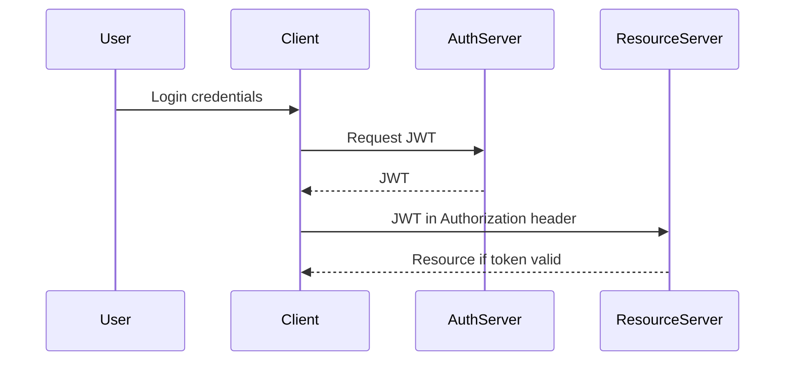
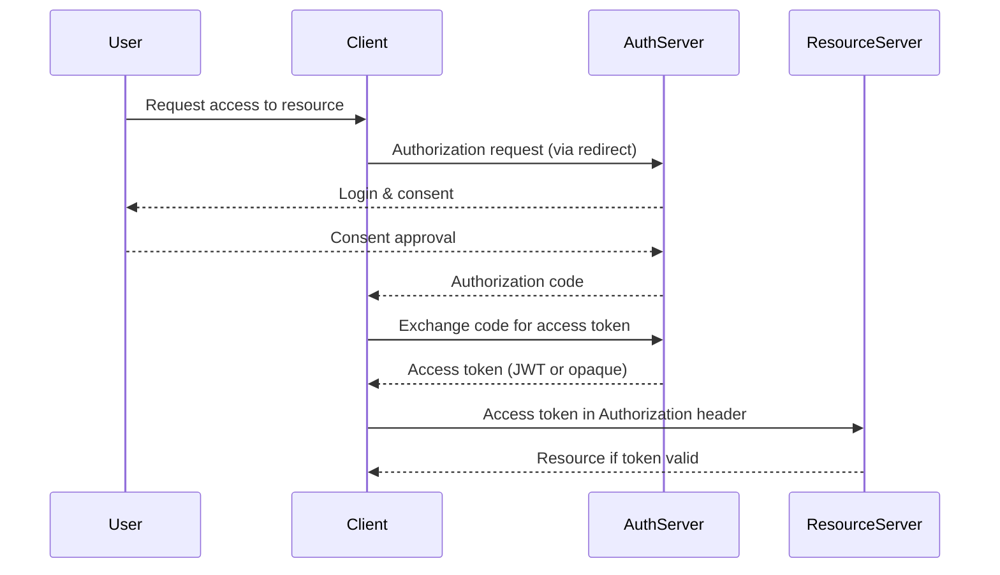

JSON Web Tokens, or JWTs, are a compact, URL‑safe way to pass claims between parties. They let servers avoid storing session state, which suits web apps and APIs. A JWT has three parts: header, payload, and signature, all base64url encoded and joined with dots. The payload isn’t encrypted, so don’t put secrets in it.

The header says how the token was created. It usually includes `typ: JWT` and `alg` for the signing algorithm. HS256 uses a shared secret for HMAC with SHA‑256. RS256 or ES256 use asymmetric keys—the issuer signs with a private key, anyone can verify with the public key. This scales well across services, just keep your key management tight.

The payload carries claims about the subject and the token. Registered claims include `sub` for subject, `iat` for issued at, `exp` for expiration, and `aud` for audience. You can add public or private claims, but anyone can decode them, so keep sensitive data out. The signature protects integrity and authenticity. The server recomputes it and rejects the token if anything changed.

A common JWT lifecycle starts after login. The auth server issues a token with the needed claims and an expiration. Clients store it in memory, cookies, or localStorage, each with trade-offs. Cookies auto attach to requests, convenient but open to CSRF without `SameSite` and anti-CSRF measures. Sending tokens in the Authorization header avoids CSRF, but it puts more work on the client.

On the server, verify the signature with the secret or public key. Then check claims like `exp` and `nbf` before trusting the request. Small clock skews happen, so allow a small leeway. When `exp` passes, the token is dead. You need to reauthenticate or use a refresh token. OAuth 2.0 defines refresh tokens and ways to get new access tokens without pestering users.

JWTs scale because the server doesn’t track state, but instant logout is hard unless you keep a revocation list or use short-lived tokens. Keep claims lean, or every request pays a bandwidth tax. Pick sound algorithms, protect keys, avoid sensitive payloads, and validate every token. Use Bearer headers for APIs and handle cookies with care.

**Security considerations for JWTs:**

- **Token theft:** If someone steals a JWT, they can use it until expiration. Short-lived tokens or token revocation mitigates this.
- **Replay attacks:** Reusing captured tokens can allow unauthorized access. Implement nonce or jti (JWT ID) checks if needed.
- **Algorithm attacks:** Don’t accept tokens with `alg: none` or weak algorithms. Always enforce secure algorithms and key lengths.
- **Sensitive data exposure:** Never store passwords or secrets in payloads—they’re easily decoded.

People often confuse JWTs with OAuth. They aren’t the same. OAuth 2.0 is an authorization framework—it defines how clients get access tokens with consent and server checks. JWT is a token format, sometimes used to carry claims. OpenID Connect builds on OAuth and standardizes ID tokens as JWTs, which is why you see them in modern login flows.

Take Google Sign In. OAuth handles redirects, consent, and the token exchange. The returned ID token is a JWT. You verify the signature and claims like `iss`, `sub`, `aud`, and `exp`. That confirms the token came from the right issuer, targets the right audience, and isn’t expired. They solve different parts of the problem, and they work well together.

**Security considerations for OAuth 2.0:**

- **Authorization code interception:** Always use PKCE (Proof Key for Code Exchange) in public clients to prevent code stealing.
- **Redirect URI attacks:** Validate redirect URIs strictly to prevent malicious redirects.
- **Token leakage:** Access tokens or refresh tokens exposed via URL, localStorage, or logs can be misused. Use secure storage and HTTPS.
- **CSRF / clickjacking:** OAuth flows involving redirects must guard against CSRF and clickjacking, especially in web apps.

### JWT Flow

### OAuth 2.0 Flow

| Feature        | JWT                                                                                    | OAuth 2.0                                                                                                |
| -------------- | -------------------------------------------------------------------------------------- | -------------------------------------------------------------------------------------------------------- |
| Type           | Token format                                                                           | Authorization framework                                                                                  |
| Purpose        | Pass claims between parties, stateless authentication                                  | Manage delegated access and token issuance                                                               |
| Structure      | Header.Payload.Signature (base64url)                                                   | Access tokens (JWT or opaque) plus refresh tokens                                                        |
| Server Storage | Not required                                                                           | Tokens may be stored or managed by the server                                                            |
| Claims         | sub, iat, exp, aud plus custom                                                         | Standardized scopes and permissions, optional ID token claims                                            |
| Security       | Signature ensures integrity, payload not encrypted, beware of theft and replay attacks | Token issuance via secure flows, supports JWTs for ID tokens, watch for code interception, token leakage |
| Flow           | Simple login → token → API                                                             | Redirect → consent → code → token → API                                                                  |
| Use Case       | Stateless APIs, microservices, SPA auth                                                | Third party app access, delegated permissions, login flows                                               |
| Pros           | Lightweight, scalable, self-contained                                                  | Flexible, standardized, supports refresh tokens                                                          |
| Cons           | Instant logout is hard, risk of exposing sensitive data                                | More complex, requires server coordination and redirects                                                 |
