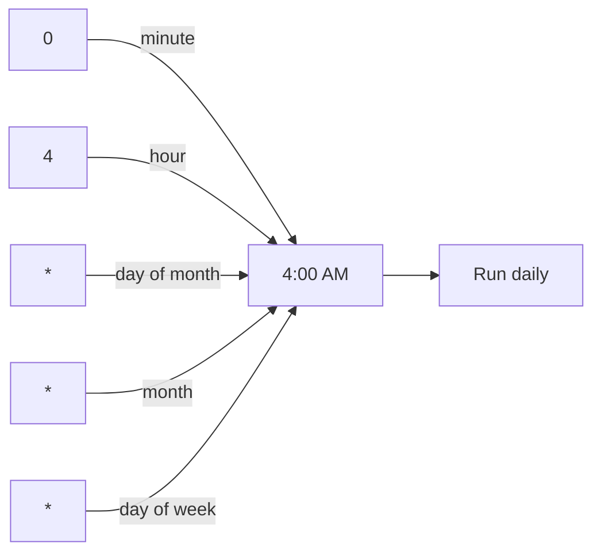

First time you see a cron job, it looks like somebody pressed random keys on the keyboard. `0 4 * * 6` and then the path to a backup script. But it's just five fields and a command. Once you know the five, you can read any cron job at a glance.

## The Five Fields

You've got a script that backs up your databases, and you want Linux to run it on a schedule. You open your own crontab with `crontab -e`, or root's table if the script needs administrative rights.

On Debian and Ubuntu, the file opens with a commented line that's quietly doing you a favor. It spells out the field order:

```bash
# m h  dom mon dow   command
```

That's minute, hour, day of month, month, day of week, then the command. Five fields, then the thing to run.

| Field        | Position | Meaning        |
| ------------ | -------- | -------------- |
| minute       | 1        | 0 to 59        |
| hour         | 2        | 0 to 23        |
| day of month | 3        | 1 to 31        |
| month        | 4        | 1 to 12        |
| day of week  | 5        | 0 to 7         |
| command      | 6        | what to run    |

## The Ranges

This is where people guess wrong. Minute is 0 to 59. Hour is 0 to 23, so there's no morning or evening marker anywhere. `4` means 4:00 in the morning. Day of month is 1 to 31. Month is 1 to 12. And day of week runs 0 to 7, where 0 and 7 both mean Sunday.

```bash
# minute  hour  day-of-month  month  day-of-week  command
   0        4        *           *         *       /usr/local/bin/backup.sh
```

## The Asterisk Means Every

The asterisk is what unlocks it, because an asterisk just means every. So minute 0, hour 4, then every day of the month, every month, every day of the week. The backup runs at 4:00 in the morning, daily.



## Weekly Instead of Daily

Want it weekly instead? Drop a `6` in the day of week slot, put `30` in the minutes, and the same script runs at 4:30 in the morning, Saturdays only.

```bash
# minute  hour  day-of-month  month  day-of-week  command
   30      4        *           *         6       /usr/local/bin/backup.sh
```

Save the file and cron picks it up on its own. No restart, no reload, no ceremony.

## The 24-Hour Clock Gotcha

The field that confuses engineers is the hour. It's a 24-hour clock. If you want 10:00 at night, you write `22`. And a job set to `10` runs at 10:00 in the morning.

```bash
# 10:00 AM
0 10 * * * /usr/local/bin/backup.sh

# 10:00 PM
0 22 * * * /usr/local/bin/backup.sh
```

## The Bottom Line

Cron is just five numbers and a command. Minute, hour, day of month, month, day of week, then what to run. Asterisks mean every, the hour is a 24-hour clock, and day of week counts Sunday as both 0 and 7. Once you've got those rules, the random keys turn into a schedule you can read at a glance.
