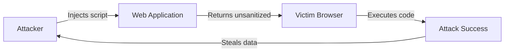
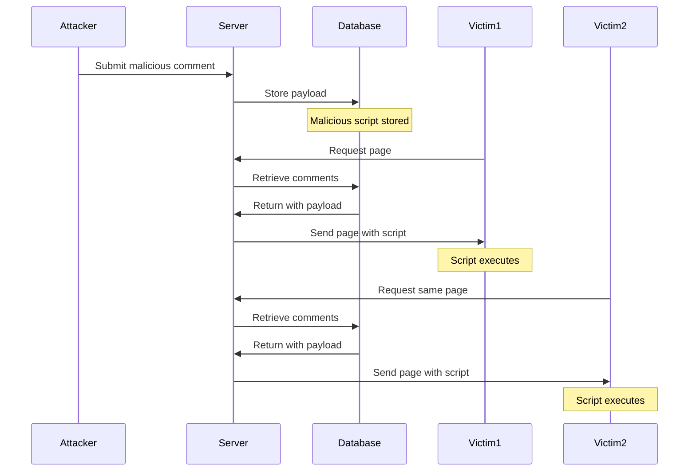
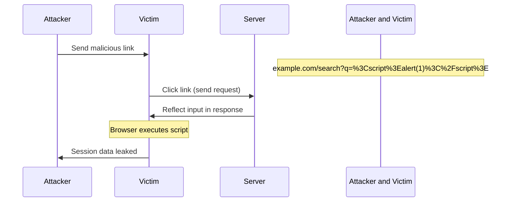
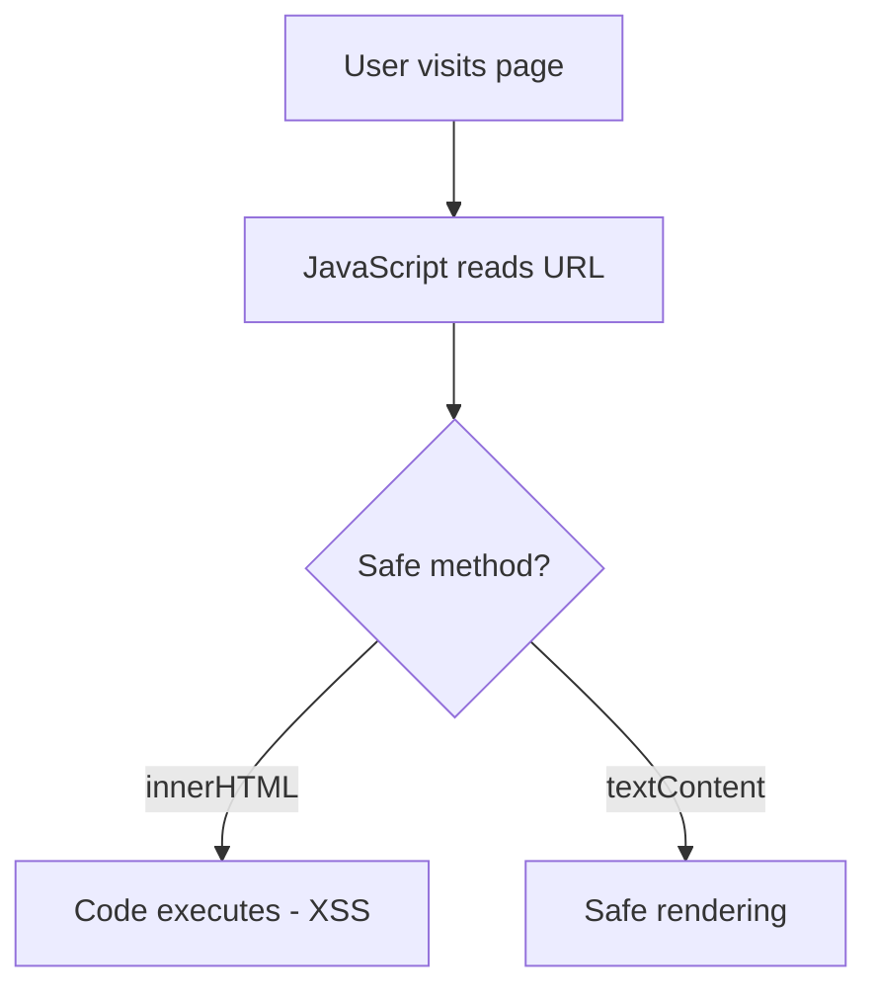
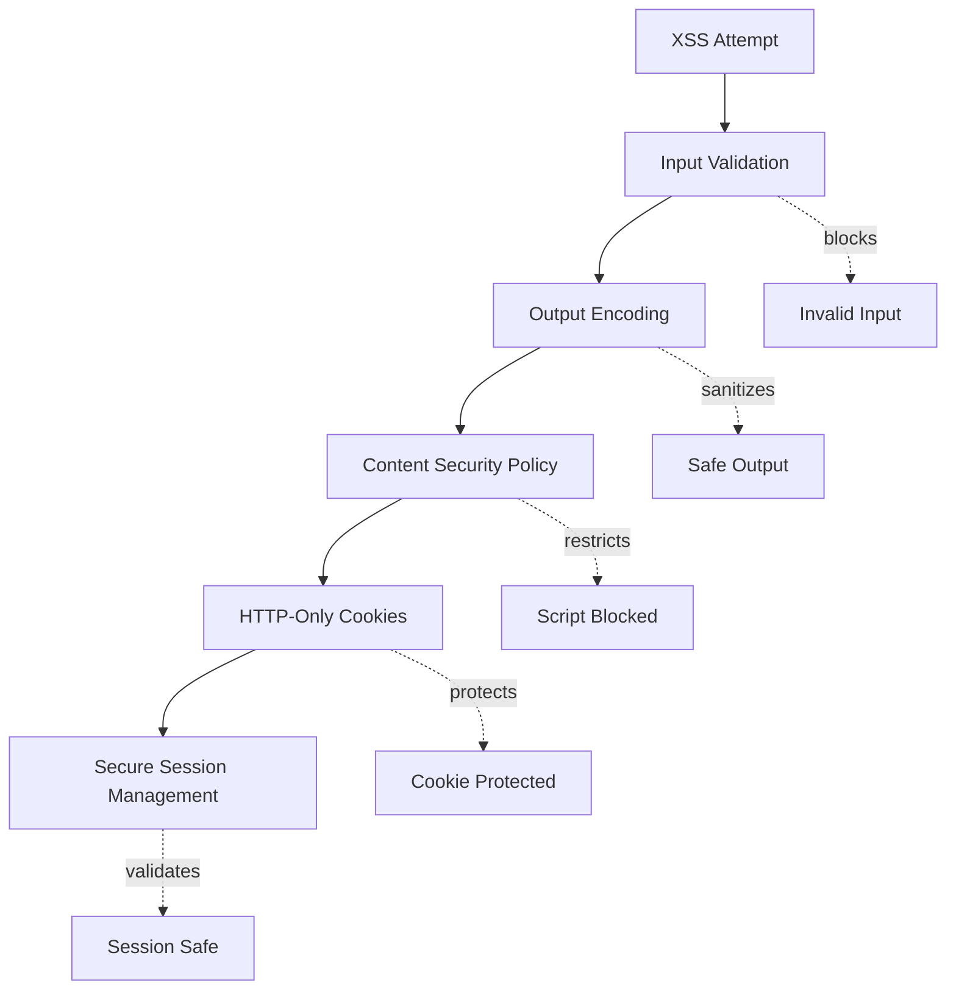
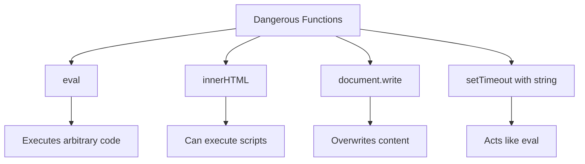
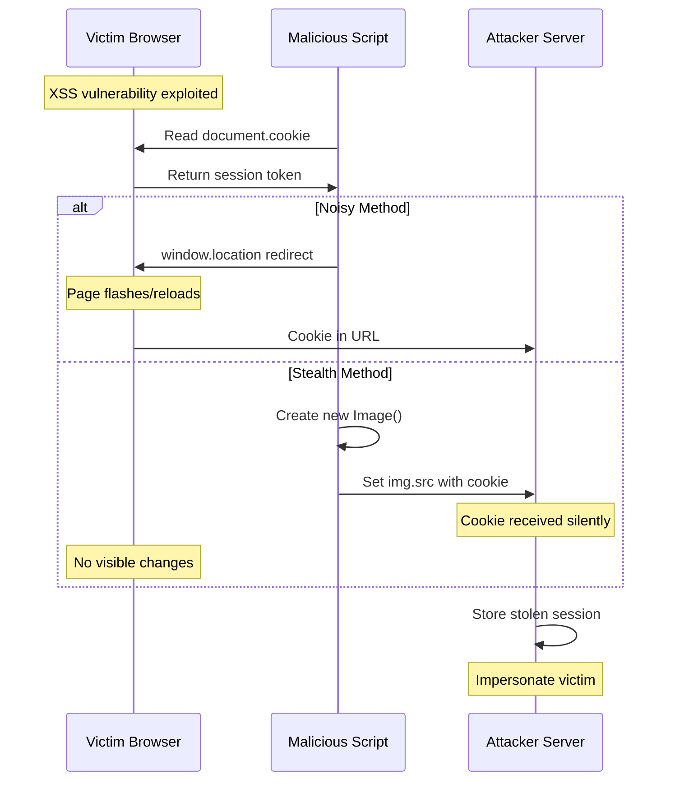
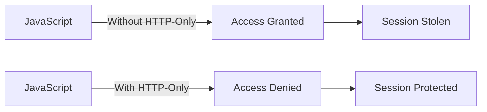
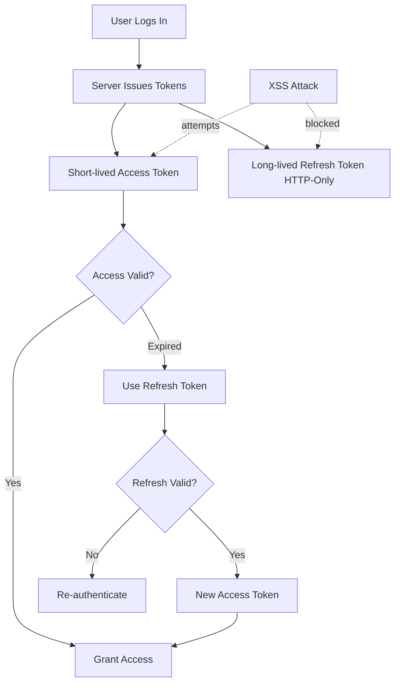
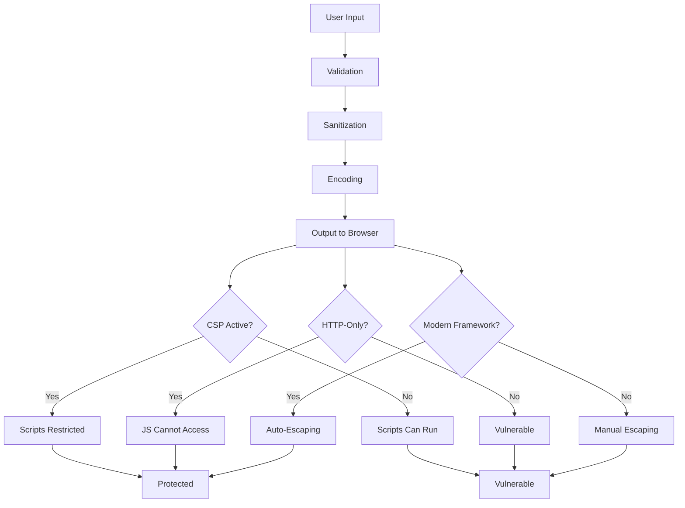

**Co-authored by:** [Nirmala NB](https://www.linkedin.com/in/nirmala-nb/) | [Website](https://nirmala.mrsamdev.xyz/)

Most engineers think they understand XSS. They don't. You'll hear people say "cross-sight," but it's actually "cross-site scripting." We call it XSS because CSS was already taken by Cascading Style Sheets. If you work in web security or development, this is baseline knowledge you can't skip.

## The Core Mechanism

Here's what happens: attackers inject malicious code into your web application, usually JavaScript. Your browser executes it because it can't tell the difference between your legitimate scripts and their garbage. The reason? Your application doesn't sanitize user input before spitting it back out.

## Three Primary Categories

### 1. Persistent XSS (Stored)

The attacker's payload lives in your database. Every user who hits that page gets infected. A forum post with malicious code? Everyone who reads it triggers the exploit. Attackers love this method for stealing credentials, logging keystrokes, or spreading malware fast.

### 2. Non-Persistent XSS (Reflected)

The malicious content bounces right back from the server without getting stored. You see this in search queries or error messages. It's temporary, but it works when you pair it with social engineering. Attackers craft sketchy URLs and trick people into clicking them.

### 3. Client-Side XSS (DOM-based)

This one never touches your server. JavaScript grabs data from the URL and shoves it straight into the page using something like innerHTML. No server processing means these bugs slip past a lot of security reviews.

## Defense Strategies

Tools like SuperTokens give you practical protection through HTTP-only cookie flags. JavaScript can't touch session tokens. Their setup uses short-lived access tokens with longer refresh tokens, so you're not exposing credentials for long. The server handles all auth decisions, and they bake in anti-CSRF protection.

## What Actually Works

Encode your output. Treat all user data as plain text, not executable code. Use textContent instead of innerHTML. Input validation helps, but don't bet everything on it. Set up Content Security Policies to block unauthorized scripts.

React, Angular, and Vue give you automatic escaping, which cuts your risk way down. But you can still screw it up if you're careless.

### Dangerous Functions to Avoid

## Session Theft Techniques

Session cookies are what attackers want. If you don't set HTTP-only flags, scripts can read document.cookie. Basic attacks just grab that data and send it to the attacker's server.

## HTTP-Only Cookie Protection

## Token-Based Security Architecture

## Comprehensive XSS Prevention Strategy

Once attackers steal your credentials, they own the account. No password needed. That's why you need multiple layers: HTTP-only cookies, solid session management, and enforced CSPs turn XSS from a critical threat into something you can actually manage.

---

**Reference:** [MDN Web Security - XSS](https://developer.mozilla.org/en-US/docs/Web/Security/Attacks/XSS)
