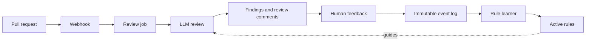

**Project Overview**

`pica` is a self-learning code review agent. It reviews pull requests with an LLM, then learns from how people respond: repeatedly dismissed findings are de-emphasized, while repeatedly confirmed findings are emphasized in future reviews. It evolved from Kavalx, the first experiment.

## Why

LLM reviewers can flood pull requests with findings. When people dismiss most of them, they eventually stop reading the bot altogether. Pica treats every dismissal and confirmation as a training signal, with a measurable goal: its dismissal rate should fall over time.

- Repeatedly dismissed patterns should stop being flagged
- Repeatedly confirmed patterns should receive more emphasis
- Learning must be inspectable and testable, not a black box
- The feedback loop must prove its value through measurable outcomes

## How It Works

- A webhook creates a review job for a pull request
- The LLM produces findings and posts review comments
- Human responses become learning events
- The rule learner updates active rules for future reviews

## Core Principles

- **Auditable:** every learned rule traces back to the dismissed or confirmed findings that produced it.
- **Falsifiable:** suppressed patterns are occasionally re-flagged, while stale rules decay and retire.
- **Safe:** secrets, authentication, injection, data-loss, and concurrency findings are never automatically suppressed.
- **Rebuildable:** rules are projections of an immutable human-feedback event log and can be recreated by replaying it.
- **Measurable:** dismissal rate, suppression rate, and learning lag determine whether the learning loop works.
- **Real or absent:** each stage is implemented or omitted, with no placeholder learning behavior.

## Platform Support

- **GitHub:** priority integration for pull request review.
- **Bitbucket:** supported for a limited set of workflows.

## Experiment Status

Pica is an experiment in making AI review less noisy through explicit, auditable learning from human feedback. If the dismissal rate does not improve over time, the experiment has failed.

## Links

- [Landing page](https://pica-project.mrsamdev.xyz/landing-page)
